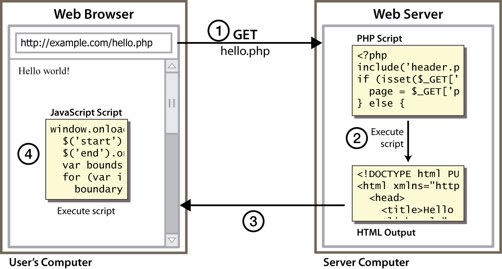

# Arquitectura d'una aplicació web
{: .no_toc }

## Taula de continguts
{: .no_toc .text-delta  .nocount }

1. TOC
{:toc}

## Elements: navegador, servidor, protocol HTTP i HTML 

El protocol de transferència d'hipertext (HTTP) és un protocol
client-servidor molt senzill que articula els intercanvis d\'informació
entre els clients web (navegadors) i els servidors HTTP.

**HTTP es basa en operacions senzilles de sol·licitud/resposta.** Quan
un client estableix una connexió amb un servidor i envia un missatge amb
les dades de la sol·licitud, el servidor respon amb un missatge similar
que conté l'estat de l'operació i el seu resultat de la sol·licitud.
Totes les operacions poden adjuntar un objecte o recurs sobre el qual
actuen; cada objecte web (document HTML, arxiu multimèdia o aplicació
CGI) és conegut pel seu localitzador uniforme de recursos (URL, _Uniform
Resource Locator_). Els recursos poden ser arxius, el resultat de
l'execució d'un programa, una consulta a una base de dades, la
traducció automàtica d'un document, etc.

**HTTP és un protocol sense estat**, és a dir, no guarda cap informació
sobre connexions anteriors. El desenvolupament d'aplicacions web
freqüentment necessita mantenir estat. Per això s'utilitzen les galetes
(*cookies*), és a dir, la informació que un servidor pot emmagatzemar en
el sistema client. Això permet que les aplicacions web institueixin la
noció de "sessió", i, alhora, permet rastrejar usuaris, ja que les
galetes es poden emmagatzemar en el client durant un temps indeterminat.

Amb la intenció de conèixer amb més profunditat el protocol HTTP podem
avaluar en què consisteix una transacció HTTP.

Cada vegada que un client fa una petició a un servidor, s'executen un
seguit d'accions:

1.  Un usuari accedeix a una adreça d'Internet (URL) seleccionant un
    enllaç d'un document HTML o introduint-la directament a la barra de
    navegació d'un navegador web des de la perspectiva del client web.
    El client web descodifica l'adreça d'Internet (URL) separant-ne les
    diferents parts. És així com s\'identifiquen el protocol d\'accés,
    el node expressat amb el nom de domini o la seua adreça IP, el
    possible port opcional (el valor per defecte és el 80) i l\'objecte
    del servidor requerit.
2.  S'obre una connexió TCP/IP amb el servidor cridant el port TCP
    corresponent. Es fa la petició. En conseqüència, s'envien l'ordre
    necessària (GET, POST, HEAD, etc.), l'adreça de l'objecte requerit
    (el contingut de l'adreça d'Internet del servidor), la versió del
    protocol HTTP utilitzada (en la major part de les ocasions és
    HTTP/1.0) i un conjunt variable d'informació que inclou dades sobre
    les capacitats del navegador web, dades opcionals per al servidor,
    etc.
3.  El servidor localitza el recurs sol·licitat i torna la resposta al
    client.
4.  Aquesta resposta consisteix en un codi d'estat i el tipus de dada
    amb extensions multipropòsit de correu d'Internet (MIME,
    Multipurpose Internet Mail Extension) de la informació de tornada,
    seguit de la mateixa informació.
5.  El client formata i mostra el recurs rebut.
6.  Es tanca la connexió TCP.

Aquest procés es repeteix en cada accés que es faça al servidor HTTP.
Per exemple, si es recull un document HTML que conté quatre imatges, el
procés de transició mostrat amb anterioritat es repeteix cinc vegades,
és a dir, una pel document HTML i quatre per les imatges.

Si el recurs sol·licitat és un programa (CGI, ASP.NET, PHP, etc.) el
servidor HTTP redirigirà la petició a la llibreria o intèrpret adequat
que executarà el programa i tornarà el control al servidor web.

### Format de les URL

La sintaxi general de les URL consisteix en una seqüència jeràrquica de
5 components:

    URI = scheme:[//authority]path[?query][#fragment]

on el component authoriry es deivideix en tres subcomponents:

    authority = [userinfo@]host[:port]

## El model client/servidor 

El model client-servidor és aquell on tots els clients estan connectats
a un servidor on es centralitzen els diferents recursos. Aquests
recursos estan a disposició dels clients cada cop que els sol·liciten.
Això fa que totes les gestions que es realitzen es concentren en el
servidor, que disposa dels requeriments dels clients amb prioritat, els
arxius que són d\'ús públic i els restringits, els arxius de només
lectura, els que poden ser modificats, etc.

En el model client/servidor, el dispositiu que sol·licita informació es
denomina client i el dispositiu que respon la sol·licitud es denomina
servidor. Els processos de client i servidor es consideren una part de
la capa d'aplicació. El client comença l'intercanvi sol·licitant les
dades al servidor, que respon enviant un o més blocs de dades al client.
Els protocols de capa d'aplicació descriuen el format de les
sol·licituds i respostes entre clients i servidor. A més de la
transferència real de dades, aquest intercanvi pot requerir informació
addicional, com l'autentificació de l'usuari i la identificació d'un
arxiu de dades per transferir.

Encara que les dades generalment es descriuen com un flux del servidor
al client, algunes dades sempre flueixen del client al servidor. El flux
de dades pot ser el mateix en les dues direccions o fins i tot ser major
en la direcció que va del client al servidor. Per exemple, un client pot
transferir un arxiu al servidor amb finalitats d'emmagatzemament. La
transferència de dades d'un client a un servidor es coneix com a pujada
i la de les dades d'un servidor a un client, baixada.

## Pàgines web estàtiques i dinàmiques 

### Pàgines web estàtiques

Les pàgines web estàtiques són aquelles on el seu contingut no varia per
la qual cosa mostraran la mateixa informació cada vegada que es
carreguen. Són les pàgines creades en el llenguatge HTML.

Només canvien si el programador web les modifica.

### Pàgines web dinàmiques

Les pàgines web dinàmiques són pàgines el contingut de les quals varia a
partir d\'informació continguda en una BBDD.

El contingut mostrat pot canviar segons l\'usuari connectat, el
navegador que s\'utiltze o accions anteriors dels usuaris, etc.

Aquest tipus de pàgines s\'han de realitzar mitjançat un llenguatge de
programació.

En el següent gràfic es mostra un escenari on podem trobar codi que
s\'executa en el servidor (PHP) i en el client (javascript).

