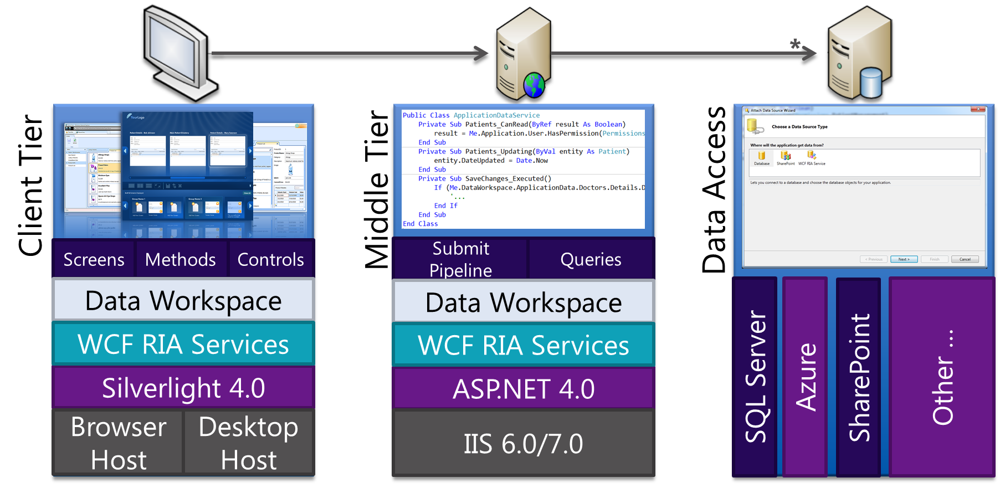

# Llenguatges 
{: .no_toc }

## Taula de continguts
{: .no_toc .text-delta  .nocount }

1. TOC
{:toc}

## PHP 

PHP (PHP Hypertext Preprocessor) és un llenguatge de programació de
costat servidor dissenyat principalment per al desenvolupament web.

PHP s\'utilitza com a llenguatge de script embegut en pàgines HTML i
funciona, normalment, com un mòdul del servidor web (per exemple, a
Apache). El servidor web combina els resultats d\'executar els scripts
PHP amb l\'HTML al qual va encastat i genera la pàgina web resultant per
al navegador.

Actualment PHP funciona pràcticament amb qualsevol servidor web i en
qualsevol Sistema Operatiu existents, i gairebé amb qualsevol SGBD en
cas que necessitem utilitzar una base de dades. Tot i això, el més
habitual és veure-ho formant el que es coneix com una arquitectura LAMP
(Linux, Apache, MySQL i PHP), és a dir, funcionant sobre un sistema
operatiu Linux, executant-com un mòdul del servidor web Apache i
utilitzant a MySQL com SGBD per emmagatzemar la informació en cas que es
requereixi una base de dades.


El llenguatge PHP va ser dissenyat per Rasmus Lerdorf i ara es manté per
una comunitat de desenvolupadors, a més és de codi obert.

A continuació, un fragment d\'una pàgina web dinàmica escrita amb PHP on
es pot apreciar com s\'incrusta el codi juntament amb l\'HTML de la
pàgina:

## JSP / Servlets

JavaServer Pages (també conegut com JSP) és una tecnologia creada per a
la creació de pàgines web dinàmiques del costat servidor. Igual que PHP,
el seu codi s\'escriu encastat juntament amb l\'HTML de la pàgina web i
és el servidor d\'aplicacions, en aquest cas, qui ha de processar-per
generar la pàgina web resultant, en HTML.

D\'altra banda, Java Servlets és una tecnologia que també es pot
utilitzar per crear contingut web dinàmic però que a més estén la seva
funcionalitat a la possibilitat de connectar aquestes webs dinàmiques
amb un altre contingut accessible a través d\'Internet. De vegades
s\'utilitza juntament amb JSP per crear aplicacions web més complexes.

Totes dues són tecnologies desenvolupades per Sun Microsystems i
propietat ara d\'Oracle, després d\'adquirir aquesta última a la primera
fa ja alguns anys.


## Python

El llenguatge Python va ser dissenyat per Guido van Rossum i ara es
manté gràcies a una comunitat de desenvolupadors, i és codi obert.


Exemple de codi escrit amb Python. En aquest cas utilitzant el framework
Django per al desenvolupament d\'aplicacions web:


```ruby
    <h1>Mis películas</h1> <a href="#">+</a>
    
    <ul>
    
    <li><a href="">{{ pelicula.titulo }}</a></li>
    
    </ul>
    
    <p>No hay películas disponibles</p>
    
```



Separada del controlador:

```python
    from django.shortcuts import render

    . . .

    def index(request):
    lista_peliculas = Pelicula.objects.all()
    context = {'lista_peliculas': lista_peliculas}
    return render(request, 'mispeliculas/index.html', context)

```


## ASP.NET 

ASP.NET és una tecnologia, creada per Microsoft, per al desenvolupament
de lloc web dinàmics, aplicacions i serveis web. És la tecnologia
successora del que abans es coneixia com ASP, l\'antiga tecnologia de
Microsoft per a la creació de pàgines web dinàmiques.

Com que funciona sobre la plataforma .NET de Microsoft, permet que es
pugui desenvolupar en qualsevol dels llenguatges de programació
d\'aquesta plataforma, Visual Basic .NET o C\#.

El més habitual és veure-ho funcionar juntament amb el lloc web de
Microsoft, IIS (Internet Information Server).



A continuació, un exemple de pàgina web dinàmica amb ASP.NET
(desenvolupada en llenguatge C \#) programant l\'acció que passa en
prémer un botó (apareix el text d\'un formulari a la part final del
web):

```asp
    protected void Button1_Click(object sender, EventArgs e)
    {
        string buf = TextBox1.Text;
        changed_text.InnerHtml = buf.ToUpper();
    }

```

```html
    <%@ Page Language="C#" AutoEventWireup="true" CodeBehind="Default.aspx.cs"
    Inherits="firstexample._Default" %>

    <!DOCTYPE html PUBLIC "-//W3C//DTD XHTML 1.0 Transitional//EN" "http://www.w3.org/TR/xhtml1/DTD/xhtml1-transitional.dtd">

    <html xmlns="http://www.w3.org/1999/xhtml" >

    <head runat="server">
    <title>
    Untitled Page
    </title>
    </head>

    <body>

    <form id="form1" runat="server">
    <div>

    <asp:TextBox ID="TextBox1" runat="server" style="width:224px">
    </asp:TextBox>

    <br />
    <br />

    <asp:Button ID="Button1" runat="server" Text="Enter..." style="width:85px" onclick="Button1_Click" />
    <hr />

    <h3> Results: </h3>
    <span runat="server" id="changed_text" />

    </div>
    </form>
    </body>
    </html>
```

