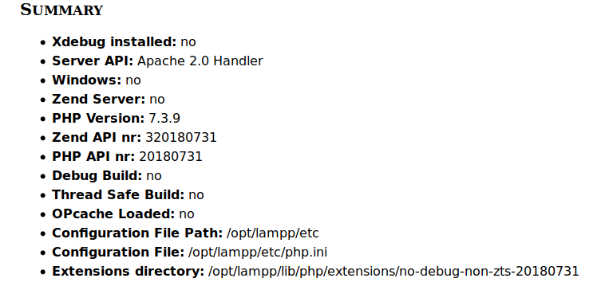

En els entorns de desevolupament és necessari disposar de ferramentes que ens
permenten depurar les nostres aplicacions. Ja siga per arreglar errors com per 
millorar l'execució del codi.

Els entorns de desevolupament d'aplicacions d'escriptori solen disposar dels seus 
propis sistemes de depuració, en el cas dels llenguatges d'entorn servidor alguns ecosistemes
  com el de .Net de Microsoft l'inclouen. Per a PHP hi ha diverses ferramentes com  XDebug o DBG.
    

{: .alert .alert-activity }

### Pràctica 4. Instal·laciò d'XDebug
{: .no_toc .nocount}
En el nostre cas utilitzarem el mòdul XDebug. A continuació, explicarem com
instal·lar aquest mòdul. Abans de res comprovarem que no el tenim
instal·lat, per a això seguirem els següents passos:

1. Obrim la pàgina de benvinguda de XAMPP escrivint al navegador la URL
[http://localhost](http://localhost).

2. A la part superior de la pàgina tenim una sèrie d'enllaços, entre
els que es troba un que diu `phpinfo`. Feu clic en aquest enllaç.

3. Se'ns mostrarà la pàgina de configuració del nostre mòdul php. Anem
a seleccionar tots els continguts d\'aquesta pàgina i els anem a copiar.

4. Obrirem al navegador la següent URL: <http://xdebug.org/wizard.php>.

5. En aquesta pàgina podrem comprovar quins mòduls tenim instal·lats en
nostre mòdul PHP. Per a això, enganxarem els continguts que hem copiat
prèviament a la caixa de text que apareix i premerem Analyse
mi phpinfo () output.

6. Ens apareixeran els resultats de la següent manera:

Com es pot observar, l'extensió XDebug no està instal·lada. 

Una altra informació important que ens dóna és que el nostre fitxer de
configuració del PHP el podem trobar en `/opt/lampp/etc/php.ini` i les
extensions les tenim en
`/opt/lampp/lib/php/extensions/no-debug-non-zts-20180731`

*És important que recordem aquestes dades.*

Per instal·lar l\'extensió XDebug seguirem les instruccions que ens
indica la pàgina anterior però compte perquè cal fer algunes
modificacions:

1.  Descarregueu [la darrera versió d'Xdebug](https://xdebug.org/download)
2.  Instal·leu els requisits previs per a la compilació d'extensions
    PHP.\
    Instal·leu-lo amb el sistema Ubuntu amb:
    `apt-get install php-dev autoconf automake`
3.  Desempaqueteu el fitxer descarregat amb `tar -xvzf xdebug-#.#.#.tgz`
4.  Executar: `cd xdebug-#.#.#`
5.  Executar: `/opt/lampp/bin/phpize` (hem canviat la ruta perquè
    execute el phpize de XAMPP).

    Com a part de la seva eixida hauria de mostrar:

        Configuring for:
        ...
        Zend Module Api No: ########
        Zend Extension Api No: 320180731

    Si no és així, estàs utilitzant phpize incorrecta. Seguiu aquesta
    entrada de FAQ i passeu al pas següent.

6.  Executar: `./configure --with-php-config=/opt/lampp/bin/php-config`
    (hem afegit la ruta del php-config de XAMPP).
7.  Compilem les fonts: `make`
8.  Executar:
    `sudo cp modules/xdebug.so /opt/lampp/lib/php/extensions/no-debug-non-zts-########`
9.  Edita `/opt/lampp/etc/php.ini` i afegeix les següents línies al
    final

        [xdebug]
        zend_extension = /opt/lampp/lib/php/extensions/no-debug-non-zts-########/xdebug.so
        xdebug.remote_enable=1
        xdebug.remote_host="localhost"
        xdebug.remote_port=9000

10. Reinicieu el servidor web

Repeteix els passos del 1 al 5 inicials per comprovar que XDebug sí està
instal·lat.

.png)

