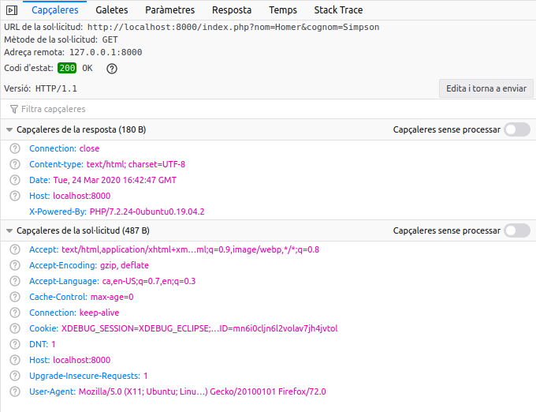

# Processament de formularis
{: .no_toc }

## Taula de continguts
{: .no_toc .text-delta  .nocount }

1. TOC
{:toc}


## Introducció

### Què és una petició HTTP?

Una petició HTTP és una sol·licitud d'un recurs a un servidor. La petició es realitza a través d'una URL. Amb la petició s'envien també paràmetres.

Hi ha diferents mètodes (METHOD) per a realitzar una petició (GET, POST, PUT, DELETE, PATCH, etc.). Els més habituals són GET i POST. La resta són més utilitzats en les RESTful API.


### Mètodes GET i POST

#### Mètode GET

S'utilitza per a sol·licitar dades d'un recurs. Mostren els paràmetres que s'envien en la url. Es poden utilitzar directament en enllaços. El resultat es pot emmagatzemar en cache. Romanen en l'historial del navegador. La grandària dels paràmetres està limitat a 255 caràcters.

*Exemple de petició GET*


*Inspecció de la petició*


*Inspecció de la petició*


#### Accedir a les dades de la petició GET

Per a accedir a les dades usem la variable superglobal `$_GET`.
    
`$_GET` és un array associatiu les claus del qual coincidiran amb els noms que li hem donat als paràmetres.

Per a accedir als paràmetres de la petició anterior:

```php
echo $_GET['nom'].' '.$_GET['cognom']; // Homer Simpson
```

{: .alert .alert-activity}
<div markdown="1">

### Exercici
{: .nocount .no_toc }

Crea una pàgina que reba com a paràmetre un nom i mostre el text ‘Benvingut [nom]!!!’ sent [nom] el nom has 
passat com a paràmetre.

Guarda-la amb el nom `exemple_get.php`.
</div>

#### Mètode POST

El mètode POST té les següents característiques:

* S'utilitza per a enviar dades a un recurs.
* Els paràmetres van en el cos de la petició, no són visibles per a l'usuari.
* La petició no es guarda en cache.
* No es pot utilitzar en un enllaç.
* No roman en l'historial.
* No tenim la limitació de grandària dels paràmetres.
* Se solen utilitzar en els formularis.

## Definició de formularis 

Com hem dit abans el mètode POST s'empra en els formularis. El formulari següent enviarà les dades a la pàgina `index.php` (atribut `action` de l'element `form`).

Utilitza el mètode `post` indicat en l'atribut `method`:

```html
<form action="index.php" method="post">
    <label for="nom">Nom</label>
    <input type="text" name="nom" value="">
    <br />
    <label for="cognom">Cognom</label>
    <input type="text" name="cognom" value="">
    <br />
    <input type="submit" value="Enviar">
</form>
```

*Inspecció de la petició: Headers*


*Inspecció de la petició: Paramètres*


### Accedir a les dades de la petició POST

Usem la variable superglobal `$_POST`. Funciona igual que `$_GET`, però amb els noms (atribut `name`) que li hem donat als camps del formulari.

En depuració podem mostar totes les dades rebudes:
        
```php
var_dump ($_POST);
print_r($_POST)
```

Per a mostrar les dades individualment:

```php
echo $_POST['nom'];
echo $_POST['cognom'];
```

{: .alert .alert-activity}
<div markdown="1">

### Activitat 12 A: Creació d'un formulari
{: .nocount .no_toc }

Crea un formulari que tinga els següents camps:
        
* Nom i cognoms
* Data de naixement
* Correu electrònic
* Assumpte
* Missatge

En l'atribut `action` del formulari posarem el següent:

```php
action="<?= $_SERVER['PHP_SELF']; ?>"
```

Açò farà que siga la pròpia pàgina del formulari la que processe les dades del mateix.

En prémer `Enviar` han d'aparèixer sota el formulari les dades que s'han introduït en el mateix.
</div>

### Accedir a paràmetres no existents

Errors del tipus  

```
Notice: Undefined index: nom in /home/ubuntu/index.php on line 6
```
ens indiquen que la clau `nom`  no existeix en l'array `$_POST`. La variable supergloblal `$_POST` està buida si no s'ha
enviat el formulari.

Per a evitar aquest tipus d'errors és important verificar que s'haja enviat el formulari prèviament:

```php
if ($_SERVER['REQUEST_METHOD'] === 'POST')
{

}
```

{: .alert .alert-activity}
<div markdown="1">

### Activitat 12 B: Creació d'un formulari
{: .nocount .no_toc }

Soluciona el problema dels paràmetres no enviats de l'exercici anterior.
</div>

## Validació de formularis 

Hem de comprovar que les dades que envia el formulari són correctes.

Les validacions a realitzar són les següents:

1. Els camps requerits no han de quedar buits. Ni contenir espais en blanc a l'inici i al final.
2. Els camps email i data han de tenir el format esperat.
3. Tots els camps s'han de filtrar amb `htmlspecialchars` per a evitar atacs de _Cross-site Scripting_ (XSS).

### Valors buits

1. Els camps requerits no deurien quedar-se buits.
2. Per a verificar que un valor no queda buit podem utilitzar la funció `empty()` de PHP.

### Espais en blanc

1. Hem d'eliminar els espais en blanc del principi i final dels camps.
2. S'utilitza la funció `trim`

### Escapar l'entrada

Sempre hem de filtrar l'entrada amb `htmlspecialchars` abans de mostrar el camp amb `echo` o similar.

### Comprovar l'email

Per a verificar si un email és correcte podem utilitzar la funció `filter_var` 

```php
filter_var($email, FILTER_VALIDATE_EMAIL)
```
o la funció `filter_input` quan obtenin les dades directament d'una variable extern.

#### filter_input

```php
filter_input(int $type, string $variable_name[, int $filter=FILTER_DEFAULT[, mixed $options]]):mixed
```
La funció `filter_input` agafa una variable externa (`$_GET`, `$_POST`, etc) concreta pel seu nom i aplica el filtre indicat.

Els filtres poden [sanejar](https://www.php.net/manual/es/filter.filters.validate.php) o [validar](https://www.php.net/manual/es/filter.filters.sanitize.php) les variables externes.

Per exemple, si volem agafar el valor del paràmetre *nom*  del querystring (http://localhost/index.php?nom=<h1>Homer</h1>) usarem el tipus INPUT_GET.

El fltre FILTER_SANITIZE_STRING elimina etiquetes, i opcionalment elimina o codifica caracters especials.

```php
$nom = filter_input(INPUT_GET, 'nom', FILTER_SANITIZE_STRING).  // $nom = Homer
```

Més informació en:

* [filter_var](http://php.net/manual/es/function.filter-var.php)
* [filter_input](http://php.net/manual/es/function.filter-input.php)

### Comprovar la data

* Per a comprovar la data hem de crear una funció a aquest efecte.
* Podem utilitzar el mètode estàtic `createFromFormat` de la classe `DateTime`

Més informació: [http://php.net/manual/es/datetime.createfromformat.php](http://php.net/manual/es/datetime.createfromformat.php)

#### Exemple

```php
$data1 = "2001-05-02"; // Data és de tipus string
// DateTime::createFromFormat converteix una cadena de text a on objecte DateTime
// ens tornarà una instància de DateTime o FALSE en cas d'error.

$dt1 = DateTime::createFromFormat('Y-m-d', $data1);  

if ($dt1 === false) {
    echo "La data d'inici és incorrecta";
}
```

https://www.php.net/manual/es/function.strtotime.php

També és habitual trobar els controls de data separats en 3 elements input. Un per a l’any, l’altre per a mes i l’altre per al dia.

{: .alert .alert-activity}
<div markdown="1">

### Activitat 12 C: Validació d'un formulari
{: .nocount .no_toc }

Modifica l'exercici anterior realitzant les validacions oportunes.
</div>

## Bones pràctiques en l’obtenció de dades des de l’exterior ($_GET, $_POST, etc.)

Cal seguir les següents bones pràctiques:

1. No confieu mai (mai) en l’entrada des de l’exterior del vostre PHP.
2. Sanegeu i valideu l’entrada de dades sempre.
3. Les funcions `filter_var()` i `filter_input()` poden sanejar el text i validar els formats de text (per exemple, adreces de correu electrònic).
4. Recordeu que l’entrada de dades no es limita a formularis enviats per l’usuari. Els fitxers carregats i descarregats, els valors de sessió, les dades de galetes i les dades de serveis web de tercers també són d’entrada estrangera.

A mode de resum podíem resumir la gestió de formularis en el següent diagrama de flux.


## Pujada d'arxius

Per a pujar arxius PHP implementa un mecanisme senzill a través de la variable superglobal `$_FILES`.

En [Pujada d'arxius](https://www.php.net/manual/es/features.file-upload.php) disposeu de tota la informació necessària per a gestionar la pujada d'arxius.

### Algunes consideracions

#### Formulari

Per poder utilitzar el tipus `file` en l'element `input` cal que el formulari incloga l'atribut `enctype="multipart/form-data"`. 

El valor de l'atribut `name` de l'element `input` serà l'índex de l'array associatiu `$_FILES` que ens permetrà obtenir tota la informació del fitxer pujat.

En el següent exemple:

```html
<input type="file" class="form-control" name="image" />
```

Emprarem `$_FILES['image']` per obtenir les dades de l'arxiu penjat.

#### Moure el fitxer

El fitxer pujat es guarda en una carpeta temporal. Hem d'emprar la funció [`move_uploaded_file`](https://www.php.net/manual/es/function.move-uploaded-file.php) per a guardar-lo a la ubicació definitiva. 

Abans d'això és molt recomanable emprar la funció [`is_uploaded_file`](https://www.php.net/manual/es/function.is-uploaded-file.php) per a assegurar-nos que l'arxiu que anem a moure ha estat pujat usant HTTP POST i no es tracta d'un arxiu maliciós.

#### Gestió d'errors

PHP torna un códi d'error en l'array de fitxers. El codi es pot trabar en la clau `error` del array de fitxers que PHP crea en pujar els fitxers. Per exemple: `$_FILES['fichero_usuario']['error']`. 

En [Explicació dels missatges d'error](https://www.php.net/manual/es/features.file-upload.errors.php) teniu més informació.

{: .alert .alert-activity}
<div markdown="1">

### Activitat 12 D: Pujada d'imatges (opcional)  
{: .nocount .no_toc }

Modifica l'activitat anterior afegint un camp de tipus `FILE` per a pujar una imatge al servidor. Es guardarà en la
carpeta `uploads` i es mostrarà amb la resta de dades. 
</div>


{: .alert .alert-info}
<div markdown="1">

### Formularis en HTML5  
{: .nocount .no_toc }

En els següents recursos trobaràs informació addicional sobre els controls de formularis en HTML5:
* [Formularios en HTML](https://developer.mozilla.org/es/docs/Learn/HTML/Forms) en MDN web docs.
* [Formularios en HTML5](https://developer.mozilla.org/es/docs/HTML/HTML5/Forms_in_HTML5) en MDN web docs.
* [HTML Forms](https://www.w3schools.com/html/html_forms.asp) en W3CSchools.
</div>


