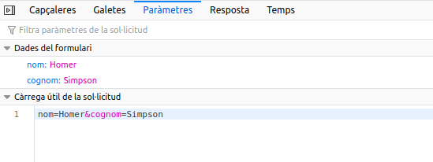
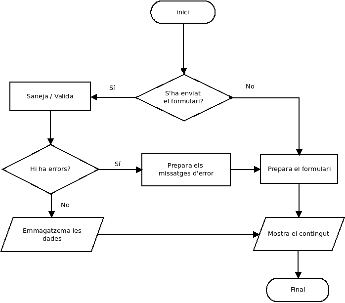

# Processament de formularis
{: .no_toc }

## Taula de continguts
{: .no_toc .text-delta  .nocount }

1. TOC
{:toc}


## Introducció

### Què és una petició HTTP?

Una petició HTTP és una sol·licitud d'un recurs a un servidor. La petició es realitza a través d'una URL. Amb la petició s'envien també paràmetres.

Hi ha diferents mètodes (METHOD) per a realitzar una petició (GET, POST, PUT, DELETE, PATCH, etc.). Els més habituals són GET i POST. La resta són més utilitzats en les RESTful API.


### Mètodes GET i POST

#### Mètode GET

S'utilitza per a sol·licitar dades d'un recurs. Mostren els paràmetres que s'envien en la url. Es poden utilitzar directament en enllaços. El resultat es pot emmagatzemar en cache. Romanen en l'historial del navegador. La grandària dels paràmetres està limitat a 255 caràcters.

*Exemple de petició GET*


*Inspecció de la petició*


*Inspecció de la petició*


#### Accedir a les dades de la petició GET

Per a accedir a les dades usem la variable superglobal `$_GET`.
    
`$_GET` és un array associatiu les claus del qual coincidiran amb els noms que li hem donat als paràmetres.

Per a accedir als paràmetres de la petició anterior:

```php
echo $_GET['nom'].' '.$_GET['cognom']; // Homer Simpson
```

{: .alert .alert-activity}
<div markdown="1">

### Exercici
{: .nocount .no_toc }

Crea una pàgina que reba com a paràmetre un nom i mostre el text ‘Benvingut [nom]!!!’ sent [nom] el nom has passat com a paràmetre.

Guarda-la amb el nom `exemple_get.php`.
</div>

#### Mètode POST

El mètode POST té les següents característiques:

* S'utilitza per a enviar dades a un recurs.
* Els paràmetres van en el cos de la petició, no són visibles per a l'usuari.
* La petició no es guarda en cache.
* No es pot utilitzar en un enllaç.
* No roman en l'historial.
* No tenim la limitació de grandària dels paràmetres.
* Se solen utilitzar en els formularis.

## Definició de formularis 

Com hem dit abans el mètode POST s'empra en els formularis. El formulari següent enviarà les dades a la pàgina `index.php` (atribut `action` de l'element `form`).

Utilitza el mètode `post` indicat en l'atribut `method`:

```html
<form action="index.php" method="post">
    <label for="nom">Nom</label>
    <input type="text" name="nom" value="">
    <br />
    <label for="cognom">Cognom</label>
    <input type="text" name="cognom" value="">
    <br />
    <input type="submit" value="Enviar">
</form>
```

*Inspecció de la petició: Headers*


*Inspecció de la petició: Paramètres*



### Accedir a les dades de la petició POST

Usem la variable superglobal `$_POST`. Funciona igual que `$_GET`, però amb els noms (atribut `name`) que li hem donat als camps del formulari.

En depuració podem mostar totes les dades rebudes:
        
```php
var_dump ($_POST);
print_r($_POST)
```

Per a mostrar les dades individualment:

```php
echo $_POST['nom'];
echo $_POST['cognom'];
```

{: .alert .alert-activity}
<div markdown="1">

### Creació d'un formulari
{: .nocount .no_toc }

Crea un formulari que tinga els següents camps:
        
* Nom
* Data de naixement
* Email
* Observacions


En l'atribut `action` del formulari posarem el següent:

```php
action="<?= $_SERVER['PHP_SELF']; ?>"
```

Açò farà que siga la pròpia pàgina del formulari la que processe les dades del mateix.

En prémer `Enviar` han d'aparèixer sota el formulari les dades que s'han introduït en el mateix.
</div>

### Accedir a paràmetres no existents

Errors del tipus  

```
Notice: Undefined index: nom in /home/ubuntu/index.php on line 6
```
ens indiquen que la clau `nom`  no existeix en l'array `$_POST`. La variable supergloblal `$_POST` és buida si no ha rebut dades d'un formulari.

Per a evitar aquest tipus d'errors és important verificar que s'haja enviat el formulari prèviament:

```php
if ($_SERVER['REQUEST_METHOD'] === 'POST')
{

}
```

{: .alert .alert-activity}
<div markdown="1">

### Exercici
{: .nocount .no_toc }

Soluciona el problema dels paràmetres no enviats de l'exercici anterior.
</div>

## Valiadació de formularis 

Hem de comprovar que les dades que envia el formulari són correctes.

Les validacions a realitzar són les següents:

1. Els camps requerits no han de quedar buits. Ni contenir espais en blanc a l'inici i al final.
2. Els camps email i data han de tenir el format esperat.
3. Tots els camps s'han de filtrar amb `htmlspecialchars`.

### Valors buits

1. Els camps requerits no deurien quedar-se buits.
2. Per a verificar que un valor no queda buit podem utilitzar la funció `empty()` de PHP.

### Espais en blanc

1. Hem d'eliminar els espais en blanc del principi i final dels camps.
2. S'utilitza la funció `trim`

### Escapar l'entrada

Sempre hem de filtrar l'entrada amb `htmlspecialchars` abans de mostrar el camp amb `echo` o similar.

### Comprovar l'email

Per a verificar si un email és correcte podem utilitzar la funció `filter_var` 

```php
filter_var($email, FILTER_VALIDATE_EMAIL)
```
o la funció `filter_input` quan obtenin les dades directament d'una font exterior.

Més informació en:

* [filter_var](http://php.net/manual/es/function.filter-var.php)
* [filter_input](http://php.net/manual/es/function.filter-input.php)

### Comprovar la data

* Per a comprovar la data hem de crear una funció a aquest efecte.
* Podem utilitzar el mètode estàtic `createFromFormat` de la classe `DateTime`

Més informació: [http://php.net/manual/es/datetime.createfromformat.php](http://php.net/manual/es/datetime.createfromformat.php)

#### Exemple

```php
$data1 = "2001-05-02"; // Data és de tipus string
// DateTime::createFromFormat converteix una cadena de text a on objecte DateTime
// ens tornarà una instància de DateTime o FALSE en cas d'error.

$dt1 = DateTime::createFromFormat('Y-m-d', $data1);  

if ($dt1 === false) {
    echo "La data d'inici és incorrecta";
}
```

https://www.php.net/manual/es/function.strtotime.php

També és habitual trobar els controls de data separats en 3 elements input. Un per a l’any, l’altre per a mes i l’altre per al dia.

{: .alert .alert-activity}
<div markdown="1">

### Validació d'un formulari
{: .nocount .no_toc }

Modifica l'exercici anterior realitzant les validacions oportunes.
</div>

## Bones pràctiques en l’obtenció de dades des de l’exterior ($_GET, $_POST, etc.)

Cal seguir les següents bones pràctiques:

1. No confieu mai (mai) en l’entrada des de l’exterior del vostre PHP.
2. Sanegeu i valideu l’entrada de dades sempre.
3. Les funcions `filter_var()` i `filter_input()` poden sanejar el text i validar els formats de text (per exemple, adreces de correu electrònic).
4. Recordeu que l’entrada de dades no es limita a formularis enviats per l’usuari. Els fitxers carregats i descarregats, els valors de sessió, les dades de galetes i les dades de serveis web de tercers també són d’entrada estrangera.

A mode de resum podíem resumir la gestió de formularis en el següent diagrama de flux.




