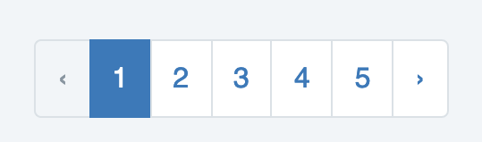

# Paginació

La paginació és el procés de dividir un document en pàgines. En el nostre cas, limitar el nombre de registres 
una taula que volem mostrar en cada pàgina.
   



En MySQL disposem de les claúsules LIMIT i OFFSET per poder implementar la paginació.

Exemple:

```sql
SELECT * FROM post LIMIT 4 OFFSET 0
```

La consulta tornaria 4 registres a partir del primer (OFFSET 0).

Hi ha una sintaxi alternativa en la que els valors es separem per coma i s'omet la clau OFFSET:
 
```sql
SELECT * FROM post LIMIT 0, 4
```
En aquest cas l'offset es situa després de límit.

A l'hora de realitzar la consulta ho farem mitjançant consultes preparades, passant com a paràmetres l'offset i
el límit.

```php
$stmt=$conn→prepare(
"SELECT * FROM movie
 LIMIT :limit 
 OFFSET :offset");
$stmt→bindValue(':limit', 4);
$stmt→bindValue(':offset', 0);
$stmt→execute();
```

## Obtenir les dades paginades

Per a implementar la paginació  necessitarem saber:

* El límit (quants registres mostrarem).
* L'offset (a partir de quin registre mostrem).

Això ho calcularem a partir de:

* La grandària de la pàgina (límit).
* El número de pàgina actual (per a calcular l’offset).

Per conèixer el número total de pàgines caldrà saber el número total de registres.

```php
$numberOfRecordsPerPage = 4;

// el número de pàgina es sol passar en un paràmetre del _querystring_.
$currentPage = filter_input(INPUT_GET, "page", FILTER_VALIDATE_INT);

// si $currentPage és false o null després del filter_input assignarem 
// el valor 1 per defecte. 

if (empty($currentPage)) 
    $currentPage = 1;

// Calculem el offset
// si $currentPage = 1, $offset = 0
// si $currentPage = 2, $offset = 4
$offset = ($currentPage-1)*$numberOfRecordsPerPage;

// el límit el determina la grandària de pàgina
$limit = $numberOfRecordsPerPage;

$stmt=$conn→prepare(
"SELECT * FROM movie
 LIMIT :limit 
 OFFSET :offset");
$stmt→bindValue(':limit', $limit);
$stmt→bindValue(':offset', $offset);
$stmt→execute();   
```


## Navegar entre les pàgines

Obtenir les dades paginades és el primer pas. Després caldrà implementar el típic navegador.

Teniu un exemple en aquest tutorial [How to implement pagination in MySQL](https://www.digitalocean.com/community/tutorials/how-to-implement-pagination-in-mysql-with-php-on-ubuntu-18-04#step-3-—-implementing-pagination-with-php)
   
{:.alert .alert-activity}
<div markdown="1" class="activity">

### Paginació
{:.nocount .no_toc}

#### Enunciat
{:.nocount .no_toc}

1. Modifica `index.php`de forma que sols mostre les 8 pel·lícules més noves.
2. Implementa un paginador en `movies.php` de forma que mostre 10 pel·lícules per pàgina i pugam navegar entre pàgines.
3. Implementa `Model::findAllPaginated()` amb 3 paràmetres opcionals $currentPage que rebrà la pàgina 
actual, per defecte serà 1; $numberOfRecords que serà la grandària de la pàgina, per defecte serà 10; i $order que 
funcionarà com en `Model::findAll()`. [Opcional].
</div>    