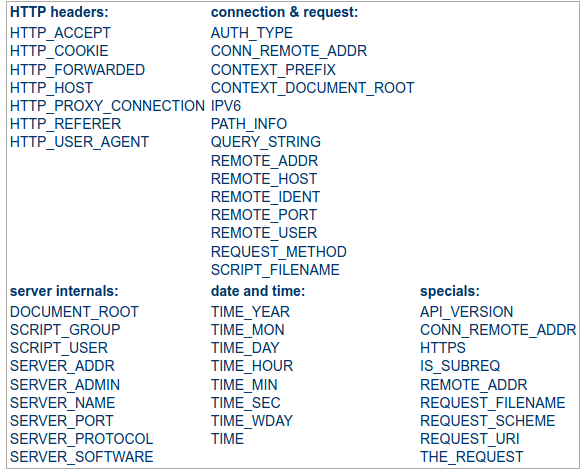

# El controlador frontal 
 
El controlador frontal és un patró de disseny que apareix en diversos catàlegs de patrons 
i està relacionat amb el disseny d’aplicacions web. És "un controlador que gestiona totes les 
sol·licituds d'un lloc web", que és una estructura útil per als desenvolupadors d'aplicacions web per 
a aconseguir la flexibilitat i la reutilització sense redundància de codi.

Normalment el controlador frontal s'implementa en la pàgina principal del lloc web: `index.php`.

Perquè el controlador frontal siga funcional és important que qualsevol petició al lloc web siga
redirigida al controlador frontal. En eixe sentit les URL amigables tenen un paper esencial.

## Què posa ahí? URL amigables

Les URL semàntiques o URL amigables són aquelles URL que, dins del que cap, poden ser enteses 
pels usuaris.

Lluny de les clàssiques URL de les pàgines dinàmiques plenes de variables en el _querystring_ i nombres difícils de recordar, les URL semàntiques estan formades amb paraules relacionades amb el contingut de la pàgina i fàcils de recordar. 

Aquestes s'utilitzen en els llocs web dinàmics (no estàtics). Per això s'estan utilitzant molt més que les URL extenses.

Suposem que vols comprar una càmera fotos. Has trobat dues botigues amb el model que busques.

La direcció de l'producte a la primera botiga és:

    http://www.example.com/B001G5ZTLS/ref=sr_1_5?s=foto&ie=UTF8&qid=1365525726&sr=1-5

I la direcció de la segona:

    http://www.example.com/camaras/reflex/canon-eos-5d-mark-2/


Quan desenvolupem una aplicació web hem de tractar que les url tinguen càrrega semàntica.

Els seus principals avantatges són:

* Fàcils de recordar i de deduir.
* Oculta de la tecnologia usada.
* És conforme a l’estil REST el que li dona consistència.
* Crear URL netes i llegibles que són més fàcils de recordar i més 
adequades per al Search Engine Optimization (SEO).


En el nostre projecte quina url tindrà més càrrega semàtica?

    http://movies.local/movies/title/ava

o 

    http://movies.local/show-movie.php?id=1488


### Reescriptura de rutes
Com hem dit abans, per a disposar d'un lloc web en url amigables necessitem que totes 
les peticions a la la nostra aplicació es redirigisquen al nostre controlador frontal 
(`index.php`)

En `index.php` obtindrem el _path_ (ruta) i cridarem al controlador adient.

Per redirigir totes les cridades al controlador frontal haurem de configurar el mòdul de
reescriptura d'Apache (**mod_rewrite**).

### Objectius de les regles de reescriptura

Els objectius són diversos:

* Amagar la funcionalitat de PHP i, per tant, exposa menys les parts internes de el lloc.
* Restringir l'accés.
* Crear URL netes i llegibles que són més fàcils de recordar i més adequades per al Search Engine Optimization.

La reescriptura d'URL és la tècnica utilitzada per "traduir" un URL amigable a una altra 
  que el servidor puga entendre.

### Directives

Perquè la reescriptura d'URL funcione tenim dues opcions:

* Introduir una sèrie de directives `<Directory>` en els fitxers de configuració d'Apache
* Introduir aquestes directives en un fitxer `.htaccess` dins del directori en el que vulgues que es realitze la reescriptura.

Nosaltres utilitzarem la segona opció.

D'aquesta manera, en producció n'hi haurà prou amb pujar el `.htaccess` al servidor i no 
necessitarem tocar la configuració.

<div markdown="1" class="info alert-info alert">
Perquè funcione `.htaccess` cal tindre activida la directiva `AllowOverride` d'Apache.
</div>

Els passos a realitzar són:

* Comprovar si existeix el `mod_rewrite`
* Totes les directives de `mod_rewrite` les introduirem dins d’una directiva IfModule:

```apache
<IfModule mod_rewrite.c>
    Directives de reescriptura
</IfModule>
```

**Deshabilitar l’opció Multiviews**

És convenient desactivar aquesta opció per evitar problemes amb fitxers que tenen noms semblants, teniu 
més informació en [What exactly does the multiviews option in htacces](thhttps://stackoverflow.com/questions/25423141/what-exactly-does-the-the-multiviews-options-in-htaccess)

```apache
<IfModule mod_rewrite.c>
    options -MultiViews
    Directives de reescriptura
</ IfModule>
```

### Directiva RewriteEngine

Per indicar a Apache que fem servir el `mod_rewrite`:
    
    RewriteEngine on

Si vols desactivar-lo i que el servidor ignore la resta de la configuració:

    RewriteEngine off


### Directiva RewriteCond

La directiva `RewriteCond`  ens permet especificar una condició. Si es compleix, s'executa la directiva `RewriteRule`
 posterior.

Es poden posar diverses condicions. Quan es compleixen totes les condicions (llevat que s'indique una altra cosa) 
s'executa la directiva `RewriteRule` posterior

La seua sintaxi és: 

    RewriteCond variable_apache expresión_regular flags

Hi ha diverses variables per a condicions com es pot observar en la imatge:

.

Nosaltres usarem `REQUEST_FILENAME` que emmagatzema la URL sol·licitada per l'usuari.

Després de la variable indicarem una expressió regular per seleccionar les adreces que es corresponen amb un 
determinat patró. Existeixen també una sèrie de variables predefinides que es poden utilitzar en comptes 
d'introduir una expressió regular:

* `-d`: es tracta la URL com si fos una ruta d'el sistema d'arxius i es comprova si existeix i si és un directori.
* `-f`: igual que l'anterior, però comprovant si és un fitxer.
* `-l`: Igual que els anteriors, però comprovant si és un enllaç simbòlic.
Etc.

Si indiquem el símbol `!` Davant de l'expressió regular o la variable, l'estem negant, és a dir, 
que s'avaluarà la condició a cert quan no coincideixi amb l'expressió indicada.

**Flags (banderes)**  

Podem indicar una llista de flags per especificar un comportament determinat:

nocase | NC: El testeig és insensible a majúscules i minúscules(no _case-sensitive_).
ornext | OR: S'utilitza l'operació OR (en lloc de AND que és l'opció per defecte) per combinar el resta de
 condicions en les regles

Per exemple:

```apacheconfig
RewriteCond %{HTTP_USER_AGENT} ^exemple [OR, NC]
RewriteCond %{HTTP_USER_AGENT} ^google [NC]
```

La variable %{HTTP_USER_AGENT} representa el nom del navegador que utilitza l'usuari.

L'expressió regular s'utilitza per determinar quin és el valor de la variable que estem analitzant. En aquest exemple
`^exemple` indica que el nom del navegador comença per `exemple`.

En els flags s'indica que les dues condicions s'agrupen com operacions OR, és a dir, el nom de el navegador 
ha de començar per `exemple` o per `google`.

El valor NC indica que no ha de distingir entre majúscules i minúscules.

### Directiva RewriteRule

Aquesta directiva serà l'encarregada de realitzar la redirecció (reescriptura) corresponent.

Sintaxi:

    RewriteRule expresión_regular redirecció flags

Mitjançant el caràcter "-" indicarem que no volem cap pàgina de redirecció

### El nostre cas

```apache
<IfModule mod_rewrite.c>
    Options -MultiViews
    RewriteEngine On

    RewriteCond %{REQUEST_FILENAME} !-f
    RewriteRule ^(.*)$ /index.php [QSA,L]

</IfModule>
```

`RewriteCond` indica qualsevol sol·licitud que no siga un fitxer.

I en `RewriteRule` l'expressió regular selecciona qualsevol URI. 

Tenint en compte les següents que:
 
 *  `^` indica que l'inici 
 *  `$` indica el final.
 *  `()` representa una agrupació
 *  `.` representa qualsevol caràcter excepte espai.
 *  `*` representa que el caràcter anterir es pot repetir.

L'expressió regular `^(.*)$` indica que es seleccionarà qualsevol cadena de text que entre l'inici i el final continga
qualsevol caràcter que no siga espai, és a dir, qualsevol URL. 

Els flags indiquen:
 
 * `QSA`, les _query strings_, d'existir, es combinen en la reescritura.
 * `L`, indica que aplicada la regla, s'ature l'execució. 

Més informació:
* [Apache mod_rewrite](https://httpd.apache.org/docs/2.4/rewrite/)