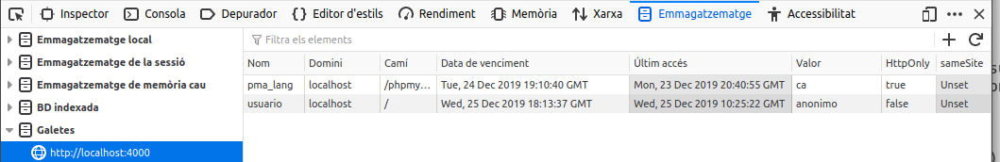

<!-- _class: lead -->
# Seguretat i control d'errors
---
## Necessitat d'identificació
Moltes vegades és important verificar la identitat dels dos extrems d'una comunicació, hi ha mètodes per identificar
tant al servidor en el qual s'allotja el lloc web, com a l'usuari del navegador que es troba en l'altre extrem.

Els llocs web que necessiten emprar identificació de servidor, com les botigues o els bancs, utilitzen el **protocol
HTTPS**. Aquest protocol requereix d'un certificat digital vàlid, signat per una autoritat fiable, que és verificat pel
navegador quan s'accedeix a la pàgina web. A més, HTTPS utilitza mètodes de xifrat per crear un canal segur entre el
navegador i el servidor, de tal manera que no es puga interceptar la informació que es transmet pel mateix.

---
## Autenticació d'usuaris
Per identificar els usuaris que visiten un lloc web, es poden utilitzar diferents mètodes com el DNI digital o
certificats digitals d'usuari però el més estès és sol·licitar a l'usuari certa informació que només ell
coneix: **la combinació d'un nom d'usuari i una contrasenya**.

Així, pot haver llocs web en els quals els usuaris autenticats poden utilitzar només una part de la informació.  Altres llocs web necessiten **separar en grups als usuaris autentificats**, de tal manera que la informació a la qual accedeix un usuari depèn del grup en què aquest es trobe. 

---
## Autenticació vs control d'accés
Has distingir l'autenticació dels usuaris i el control d'accés, de la utilització de mecanismes per assegurar les
comunicacions entre l'usuari de el navegador i el servidor web. Encara que tots dos aspectes solen anar units, són
independents.

---
## Entorn de desenvolupament
En els exemples d'aquesta unitat, la informació d'autenticació (nom i contrasenya dels usuaris) s'envia en text pla des
del navegador fins al servidor web. Aquesta pràctica és altament insegura i mai s'ha d'usar sense un protocol com HTTPS
que permeta xifrar les comunicacions amb el lloc web. 

No obstant això, la configuració de servidors web que permeten fer
servir el protocol HTTPS per xifrar la informació que reben i transmeten no forma part dels continguts d'aquest mòdul.
Per aquest motiu, durant aquesta unitat utilitzarem únicament el protocol no segur HTTP.

---
## Manteniment de l'estat

* Recorda que HTTP és un protocol sense estat.
* No hi ha manera que un servidor recorde una que una seqüència de sol·licituds prové del mateix client.

**Mantenir l'estat** és poder fer el seguiment d'una sequència de sol·licituds d'un client.

---
## Manteniment de l'estat

No obstant això mantenir l'estat, poder fer el seguiment d'una seqüència de sol·licituds d'un client, és molt útil. 
No podeu crear una aplicació que tinga cistella de la compra, per exemple, si no podeu mantenir l'estat. Heu de saber 
quan un usuari afegeix articles a la cistella o els elimina i el contingut final de la cistella si el client 
decideix adquirir els productes.

---
## Manteniment de l'estat 

Per solucionar aquesta manca d’estat de la web tenim disponibles diverses tècniques com l'ús cookies o de sessions
que veurem a continuació.

Combinant mecanismes d'autenticació i tècniques per a mantenir l'estat podem crear aplicacions web segures.

---

<!--
_class: lead 
header: 8. Seguretat i control d'errors / Galetes
-->
# Galetes (*cookies*)

---
## Definició
Una galeta és un fitxer de text que un lloc web guarda a l'entorn de l'usuari de navegador. 
El seu ús més típic és l'emmagatzematge de les preferències de l'usuari (per exemple, l'idioma en que s'han de mostrar les pàgines), perquè no haja de tornar a indicar-les la propera vegada que visiteu el lloc.

---
## Inspeccionar galetes

Si utilitzes Firefox com a navegador, pots accedir a `Desenvolupador web` &ndash; `Inspector d'emmagatzematge` des del
menú principal. Entre les seves característiques et permet consultar i editar les galetes emmagatzemades en el mateix.



---
## Creació de galetes 
En PHP, per emmagatzemar una galeta al navegador de l'usuari, pots utilitzar la funció `setcookie`. L'únic paràmetre
obligatori que has de fer servir és el nom de la galeta, però admet diversos paràmetres més opcionals.

```php
setcookie ($name [, 
    $value = " " [,
    $expires = 0 [, 
    $path = "" [,
    $domain = "" [, $secure = FALSE [,
    $httponly = FALSE ]]]]]] ) : bool
```

Per a més informació consulta: [https://www.php.net/manual/es/function.setcookie.php](https://www.php.net/manual/es/function.setcookie.php).

---
## Creació de galetes. Exemple

Per exemple, si vols emmagatzemar en una galeta la data del darrer accés d'un usuari, pots fer:

```php
setcookie ("last_visit_date", (string) time(), time() + 3600);
```

* Els dos primers paràmetres són el nom de la galeta i el seu valor. 
* El tercer és la data de caducitat de la mateixa en format `timestamp` (en l'exemple, un hora des del moment en què s'execute). En cas de no figurar aquest paràmetre, la galeta s'eliminarà quan es tanque el navegador.  

--- 

## Enviament de les galetes
Les galetes es transmeten utilitzant les capçaleres del protocol 
HTTP. **Per això, les sentències `setcookie` s'han d'enviar abans que el navegador mostre cap informació a pantalla.**


Podeu trobar més informació en [Ultimate Guide to HTTP Cookies](https://blog.webf.zone/ultimate-guide-to-http-cookies-2aa3e083dbae)

---
## Lectura de galetes

El procés de recuperació de la informació que emmagatzema una galeta és molt simple, quan accedeixes a un lloc web, el
navegador li envia de forma automàtica tot el contingut de les galetes que emmagatzema relatives a aquest lloc en
concret. Des PHP pots accedir a aquesta informació per mitjà de l'array `$_COOKIE`.

---
## Cal tenir en compte
Sempre que utilitzeu galetes en una aplicació web, heu de tenir en compte que en última instància la seva 
disponibilitat està controlada pel client. Per exemple, alguns usuaris deshabiliten les galetes al navegador perquè 
pensen que la informació que emmagatzemen pot suposar un potencial problema de seguretat. O que la informació que
emmagatzemen pot arribar a perdre perquè el usuari decideix formatar l'equip o simplement eliminar-les de sistema.

---
## Eliminació
Si un cop emmagatzemada una galeta al navegador vols eliminar-la abans que expire, pots utilitzar 
la mateixa funció `setcookie` però indicant una data de caducitat anterior a l'actual.

```php
setcookie ("last_visit_date", "", time() - 3600);
```

---
## Activitat

### Activitat 1: Última visita 

Modifica la pàgina `index.php` de forma que emmagatzeme en una galeta l'últim instant en què l'usuari 
va visitar la pàgina. 

Si és la seva primera visita, mostra un missatge de benvinguda. En cas contrari, mostra 
la data i hora de la seva anterior visita. 

La galeta tindrà una durada d'una setmana.

Comprova que la galeta s'ha creat correctament.

---

#### Solució proposada
```php
declare(strict_types=1);

// it's a good practise to save the cookie name in a variable 
// to avoid misspelling errors.
$cookieName = "last_visit_date";

// we get the current cookie value
$lastVisit = filter_input(INPUT_COOKIE, $cookieName, FILTER_VALIDATE_INT);

// we can also use the coalsece operator
/* $lastVisit =(int)($_COOKIE[$cookieName] ?? null); //
// or the traditional isset
/* if (isset($_COOKIE[$cookieName])) {
    $lastVisit = (int)$_COOKIE[$cookieName];
} else
    $lastVisit = null;
*/

// if null we show a welcome message
if (empty($lastVisit))
    $message = "Welcome to our reservation system!";
else
    $message = "Welcome back, your last visit was on " . 
        date("d/m/Y h:i:s", $lastVisit);

// we register the current time and set the expiration date to the next week.
setcookie($cookieName, (string)time(), time() + 7 * 24 * 60 * 60);
```
---
### Activitat 2. Emmagatzematge del nom de l'usuari

L'objectiu és que quan un usuari faça una reserva s'emmagatzeme el nom introduït en un galeta,
 de forma que quan torne a accedir al formulari de reserva el nom aparega automàticament.

El nom de la _cookie_ serà `last_used_name` i la durada serà de 30 dies.

Nota: l'estructura és semblant a l'anterior però estarà divida en dues pàgines.

Crea la pàgina `logout.php` que en accedir eliminarà la _cookie_.

---
## Qüestió

Quina és la durada per defecte d'una galeta si no s'indica la data de caducitat,
com en la següent crida a la funció `setcookie`?

```php
setcookie ("idioma", "espanyol");
```

1. Fins que es tanque el navegador de l'usuari.
2. 1 hora.
</div>

---

<!--
_class: lead 
header: 8. Seguretat i control d'errors / Maneig de sessions
-->

# Maneig de sessions 

---

## Introducció
L'ús de cookies té algunes limitacions:
* el nombre que admet el navegador, 
* la seva grandària màxima. 
* que emmagatzema la informació completa


Per solucionar aquests inconvenients, existeixen *les sessions*. El terme sessió fa referència al
conjunt d'informació relativa a un usuari/navegador concret.

---

## Identificadors de sessió 

Cada usuari diferent d'un lloc web té la seva pròpia informació de sessió. 

Per distingir una sessió d'una altra s'usen els **identificadors de sessió** (SID). 

Un SID és un atribut que s'assigna a cada un dels visitants d'un lloc web i l'identifica. 

El servidor web relaciona tota la informació de l'usuari amb el SID.

Aquesta informació s'emmagatzema en el servidor web.

--- 

## Identificadors de sessió 

Com ja hauràs suposat, la qüestió ara és: ¿i on s'emmagatzema aquest SID, identificador de la sessió, que és únic per a cada
usuari? Doncs hi ha dues maneres de mantenir el SID entre les pàgines d'un lloc web que visita l'usuari:

* Utilitzant galetes.
* Propagant el SID en un paràmetre de la URL. El SID s'afegeix com una part més de la URL, de la forma:
  * https://www.example.com/stor/list.php&amp;**PHPSESSID=34534fg4ffg34ty**

---

## Maneig de sessions en PHP

El procés de maneig de sessions en PHP està automatitzat en gran mida.

Quan un usuari visita un lloc web, no cal programar un procediment 
per veure si hi ha un SID previ i carregar les dades associades amb el mateix.

Tampoc has d'utilitzar la funció `setcookie` si vols emmagatzemar els SID en galetes, 
o anar passant el SID entre les pàgines web del teu lloc si et decideixes per propagar. 

Tot això PHP ho fa automàticament.

--- 

### Maneig de sessions en PHP
La informació que s'emmagatzema en la sessió d'un usuari també es coneix com galetes en
la part de servidor (**server side cookies**). Has de tenir en compte que encara aquesta informació no viatja entre el
client i el servidor, sí que ho fa el SID, bé com a part de l'URL o en una capçalera HTTP si es guarda en una galeta. En
tots dos casos, això planteja un possible problema de seguretat. El SID pot ser aconseguit per una altra persona, i a
partir de la mateixa obtenir la informació de la sessió de l'usuari. La manera més segura d'utilitzar sessions és
emmagatzemant els SID en galetes i utilitzar HTTPS per a xifrar la informació que es transmet entre el servidor web i el
client.

---

## Configuració ##

Per defecte, PHP inclou suport de sessions incorporat. Abans, però, d'utilitzar sessions en el teu lloc web, has de
configurar correctament PHP utilitzant els següents directives en el fitxer `php.ini` segons corresponga:

[Directives per a gestionar les sessions](https://corriol.github.io/dwes/UD08/03_sessions.html#configuraci%C3%B3)


---

La funció `phpinfo`, de la qual ja vam parlar amb anterioritat, t'ofereix informació sobre la configuració actual de les
directives de sessió.

En la documentació de PHP tens informació sobre aquestes i altres directives que permeten configurar el maneig de
sessions.

[https://www.php.net/manual/es/session.configuration.php](https://www.php.net/manual/es/session.configuration.php)

### Questió
Si la informació de l'usuari que vols emmagatzemar inclou contingut privat com una contrasenya, 
¿què utilitzaries, galetes o la sessió de l'usuari?


---
## Inici i fi d'una sessió ##

L'inici d'una sessió pot tenir lloc de dues maneres: 

* Activant la directiva `session.auto_start` 
* Fent-ho de forma manual amb la funció `session_start()`. 

### Important
Com l'inici de sessió requereix utilitzar `cookies`, i aquestes es transmeten en els encapçalats HTTP, heu de tenir en
compte que per poder iniciar una sessió utilitzant `session_start`, hauràs de fer les cridades a aquesta funció abans
que la pàgina web mostre informació al navegador.

--- 
A més, totes les pàgines que necessiten utilitzar la informació emmagatzemada en la sessió, hauran d'executar la
funció `session_start`.

Mentre la sessió estiga oberta, pots utilitzar la variable superglobal `$_SESSION` per afegir informació a la sessió de
l'usuari, o per accedir a la informació emmagatzemada en la sessió. Per exemple, per comptar el nombre de vegades que
l'usuari visita la pàgina, pots fer:

--- 

```php
<?php
    // Iniciamos la sesión o recuperamos la anterior sesión existente
    session_start();
    // Comprobamos si la variable ya existe
    if (isset($_SESSION['visits']))
        $_SESSION['visits']++;
    else
        $_SESSION['visits'] = 0;
?>
```
---

Si en lloc de el nombre de visites, voldries emmagatzemar l'instant en què es produeix cadascuna, la variable de
sessió "visites" ha de ser una matriu i per tant hauràs de canviar el codi anterior per:

```php
// Iniciamos la sesión o recuperamos la anterior sesión existente
 session_start();
 // En cada visita añadimos un valor al array "visits"
 $_SESSION['visits'][] = time();
```
---
### Tancar sessió


En PHP tens dues funcions per eliminar la informació emmagatzemada en la sessió:

* `session_unset`. Elimina les variables emmagatzemades a la sessió actual, però no elimina la informació de la sessió
  del dispositiu d'emmagatzematge usat.
* `session_destroy`. Elimina completament la informació de la sessió del dispositiu de emmagatzematge.

## Qüestió
Amb les funcions anteriors eliminem la informació però encara ens quedaria eliminar alguna cosa més. Saps quina?


---
### Activitat 3. Registres de visites**

Modifica la pàgina `index.php` emmagatzemant en la sessió d'usuari els instants de totes les seves últimes visites.
Si és la seva primera visita, mostra un missatge de benvinguda. En cas contrari, mostra la data i hora de totes 
les seves visites anteriors. A més a més, afegeix un botó a la pàgina que permeta esborrar el registre de visites.

--- 

### Solució proposada

```php
# index.php

// We turn on the session support
session_start();

$sessionKey = "visits";

// check if is the first visit
$visits = $_SESSION[$sessionKey]??[];

// if not empty generate an HTML Unordered List
if (!empty($visits))
    $messageSession =  "<ul><li>" . implode("</li><li>", array_map(function($v) {
            return date("d/m/Y h:i:s", $v);
        }, $visits)) . "</li></ul>";
else
    $messageSession = "Welcome to our reservation system (session version)!";

$_SESSION[$sessionKey][] = time();
```
---
## Gestió de la informació de la sessió ##

Anem a utilitzar la informació de la sessió per a millorar alguns aspectes de la gestió del formulari de reserves. 

---
### Errors de validació 

La pàgina de processament del formulari `reservations-store.php` mostra els errors de validació però no el formulari, que es troba en `reservations-create.php`. 

El que farem serà controlar si hi ha errors en el processament i, en cas d'haver-ne, redireccionar a la pàgina `reservations-create.php`, emmagatzemant prèviament en la clau `errors` de la sessió els errors detectats.

Serà `reservations-create.php` qui controlarà si hi ha errors en la variable de sessió i en eixe cas els mostrarà.

---

### Redireccions

Una redirecció és una tècnica que permet fer que el servidor web responga amb una URL diferent a l'actual.

Per a aconseguir s'utilitza la funció `header()`.

```php
// Send to the browser a new url and send a HTTP redirect code (302)
header('Location: /index.php')

// this function terminate the current script
exit();
```
</div>

---

### Activitat 4. Errors de validació

Modifica les pàgines `reservations-create.php` i `reservations-store.php` per a gestionar els errors tal com s'indica
en l'explicació anterior.

Una vegada s'ha obtés la informació dels errors en la variable de sessió caldrà eliminar-la.

---
### Solució activitat 4

```php
# reservations-store.php
...
if (empty($errors)) {
    $stmt = $pdo->prepare("INSERT INTO reservation (name,date,court_id,timeslot_id) 
        VALUES (:name,:date,:court_id,:timeslot_id)");
    $stmt->bindValue('name', $name, PDO::PARAM_STR);
    $stmt->bindValue('date', $date->format("Y-m-d"), PDO::PARAM_STR);
    $stmt->bindValue('court_id', $courtId, PDO::PARAM_INT);
    $stmt->bindValue('timeslot_id', $timeslotId, PDO::PARAM_INT);
    $stmt->execute();
} else {
    session_start();
    // we save errors in a session variable
    $_SESSION["errors"] = $errors;

    // we redirect to form
    header('Location: /reservations-create.php');
    exit();
}
...

```
---

```php
# reservations-create.php

...
session_start();
$errors = $_SESSION["errors"] ?? [];
unset($_SESSION["errors"]);
...

<?php if (!empty($errors)): ?>
    <h2>Error!</h2>
    <p>There are some errors:</p>
    <ul>
        <?php foreach ($errors as $error): ?>
            <li><?= $error ?></li>
        <?php endforeach; ?>
    </ul>
<?php endif; ?>
...

```

---

### Missatges entre pàgines
Una altra qüestió a resoldre és la de la recàrrega de pàgines que han processat un formulari. Per exemple, què passa si després d'afegir una reserva actualitzem la pàgina? Es torna a intentar crear una reserva.

Per a solucionar-ho podem combinar de nou variables de sessió i redireccions. Si la reserva s'ha realitzat correctament 
podem redireccionar a la pàgina `index.php` per exemple, i usar una variable de sessió `message` per a passar a `index.php` la confirmació de que s'ha creat correctament la reserva.

---

**Activitat 5. Missatges entre pàgines**

Modifica les pàgines `reservations-store.php` i `index.php` per a gestionar els missatges tal com s'indica
en l'explicació anterior.

Una vegada s'ha obtés la informació dels missatges en la variable de sessió caldrà eliminar-la.
</div>

Més informació sobre les sessions en PHP: [Maneig de sessions (PHP)](https://www.php.net/manual/es/book.session.php)

---

## Millores en el _framework_ MVC

Com ja has vist, combinant redireccions i variables de sessió podem
millorar la gestió dels nostres formularis i, per extensió, la nostra
aplicació web.

Es per això que en el projecte `Movies` implementarem la classe `FlashMessage` que s'encarregarà de 
de gestionar tant els errors de validació com els missatges entre pàgines mitjançant 
variables de sessió.

---

```php
# src/Core/Helpers/FlashMessage.php

/**
 * Class FlashMessage
 * 
 */
class FlashMessage
{
    /**
     * @var string
     */
    private string $sessionKey;

    /**
     * FlashMessage constructor.
     * Session key is the $_SESSION key name.
     * @param string $sessionKey
     */
    public function __construct(string $sessionKey = "flash-message");

    /**
     * get the value of the key passed as argument.
     * after reading the value unsets it
     * @param string $key
     * @param string $defaultValue
     * @return mixed|string
     */
    public static function get(string $key, $defaultValue = '');

    /**
     * @param string $key
     * @param $value
     */
    public static function set(string $key, $value);

    /**
     * @param string $key
     */
    public static function unset(string $key);      
}
```
---
### Activitat 6. La classe FlashMessage 

A partir de la declaració anterior implementa la classe `FlashMessage`. Instància-la i 
afig-la al contenidor de serveis. 

Utilitza l'objecte `FlashMessage` per a gestionar els errors en la creació de partners (`partners/create`) i mostrar el missatge de confirmació en l'índex de partners (`/partners`).

Com que usem Bootstrap en el projecte poder fer ús de les seues formats d'avís.
[Alerts in Bootsrap 4.5](https://getbootstrap.com/docs/4.5/components/alerts/)
</div>