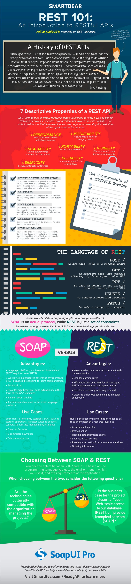

# Introducció als _web services_

De vegades, les aplicacions que desenvolupes necessitaran compartir informació amb altres
aplicacions.

Sense anar més lluny, en una aplicació de botiga en línia segurament els proveïdors als que es compren els articles, manegen la mateixa o semblant informació. I potser pugues aprofitar aquesta informació per a la teva pròpia aplicació.

O pot ser que, una vegada que estiga finalitzada i funcionant, vullgues programar una nova aplicació (no necessàriament una aplicació web) que la complemente per, per exemple, processar la informació sobre les comandes realitzades.

Per compartir la informació que gestiona la teva aplicació, normalment n'hi ha prou amb donar accés a la base de dades en què s'emmagatzema. Però aquesta generalment no és una bona idea. Com més aplicacions utilitzin les mateixes dades, més possibilitats hi ha que es generen errors en els mateixos. A més, hi ha altres inconvenients:

 * Si ja tens una aplicació funcionant, ja has programat la lògica de negoci corresponent, i aquesta no es podrà aprofitar en altres aplicacions si utilitzen directament la informació emmagatzemada a la base de dades.
 * Si vols posar la base de dades a disposició de tercers, aquests necessitaran conèixer la seva estructura. I al donar accés directe a les dades, serà complicat mantenir el control sobre les modificacions que es produeixin en els mateixos.

D'altra banda, gran part de la informació que gestionen les aplicacions web ja està disponible perquè altres la utilitzen (deixant de banda les consideracions relacionades amb el control d'accés). Per exemple, si algú vol conèixer el preu d'un producte a la botiga web, només cal buscar aquest producte a la pàgina en què es llisten tots els productes. Però, perquè aquesta mateixa informació (el preu d'un producte) la puga obtenir un programa, aquest hauria de contemplar un procediment per buscar el producte concret dins de les etiquetes HTML de la pàgina i extreure el seu preu.

Per facilitar aquesta tasca existeixen els *serveis web*. Un servei web és un mètode que permet que dos equips intercanvien informació a través d'una xarxa informàtica. A l'utilitzar serveis web, el servidor pot oferir un punt d'accés (_endpoint_) a la informació que vol compartir. D'aquesta manera controla i facilita l'accés a la mateixa per part d'altres aplicacions.

Els clients del servei, per la seva banda, no necessiten conèixer l'estructura interna d'emmagatzematge.

En lloc d'haver de programar un mecanisme per localitzar la informació, tenen un punt de
accés directe a la que els interessa.

Tornant a l'exemple de la nostra botiga, si volguéssim aprofitar la informació de què disposen els nostres proveïdors, aquests haurien d'oferir un servei web que ens permetés recuperar-la.

Per exemple, enviant-los el codi d'un producte, podríem obtenir el seu nom, vista general,
preu, etc. Inversament, si volguéssim facilitar l'obtenció de dades de la nostra botiga per part d'altres aplicacions, podríem programar i oferir un servei web de manera que, per exemple, retornés el llistat de comandes de client que es requerisca.

## Característiques

Els serveis web es van crear per permetre l'intercanvi d'informació sobre la base del protocol HTTP (per això el terme web). En lloc de definir el seu propi protocol per transportar les peticions d'informació utilitzen HTTP per a aquest fi. La resposta obtinguda no serà una pàgina web, sinó la informació que s'haja sol·licitat. D'aquesta manera poden funcionar sobre qualsevol servidor web; i, el que és encara més important, utilitzant el port 80 (o 443) reservat per a aquest protocol. Per tant, qualsevol ordinador que puga consultar una pàgina web, podrà també sol·licitar informació d'un servei web.

Si hi ha algun tallafocs a la xarxa, tractarà la petició d'informació igual que ho faria amb la sol·licitud d'una pàgina web. Existeixen al menys dues qüestions que hauria de resoldre un servei web per poder funcionar correctament:
 * **Com es transmet la informació**. Si es va a utilitzar HTTP per a les peticions i les respostes, el client i el servidor hauran de posar-se d'acord en la forma d'enviar unes i altres. És a dir, Com fa el client per indicar que vol conèixer el PVP de l'article amb codi X?, i també, com envia al servidor la resposta obtinguda?
 * **Com es publiquen les funcions a què es pot accedir a un servidor determinat**. Aquest
punt és opcional, però molt útil. És a dir, el client pot saber que la funció de servidor que ha d'utilitzar es diu `getPVPArticulo`, i que ha de rebre com a paràmetre el codi de l'article. Però si no ho sap, seria útil que hi hagués un mecanisme on pogués consultar les funcions que hi ha al servidor i com s'utilitza cadascuna.

Cadascun dels mètodes que podem utilitzar avui en dia per crear un servei web respon a
aquestes preguntes de formes diferents. 

Respecte la primera qüestió, **el protocol SOAP** utilitza el llenguatge XML per intercanviar informació. Quant a la segona qüestió, es resol amb un llenguatge anomenat WSDL, que també està basat en XML i va ser creat per descriure serveis web, és a dir, indicar com s'ha d'accedir a un servei i utilitzar-lo.

Els serveis RESTful utilitzen normalment **json** i els serveis es descriuen mitjançant documentació.

## SOAP vs REST API
En aquesta completa infografia podeu veure una interessant comparació:

Font: [https://www.soapui.org/resources/infographic/api-testing/soap-vs-rest-infographic.html](https://www.soapui.org/resources/infographic/api-testing/soap-vs-rest-infographic.html)

En el nostre cas utilitzarem REST API.

# Bibliografia

* José Luis Comesaña.  _Apuntes de formación a distancia del módulo «Desarrollo web en entorno servidor» del CFGS DAW_, elaborados y licenciados por el Ministerio de Educación, Cultura y Deporte. [en línia]. 2012 [data de consulta: 13 de setembre de 2019]. Disponible en [<https://github.com/statickidz/TemarioDAW/tree/master/DWES>](https://github.com/statickidz/TemarioDAW/tree/master/DWES)