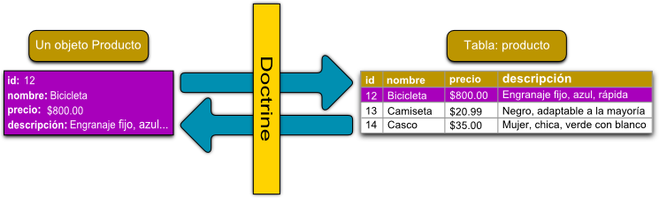

# Model
{: .no_toc }


## Taula de continguts
{: .no_toc .text-delta  .nocount }

1. TOC
{:toc}
## Introducció ##

Symfony no disposa de cap mòdul que s'encarregue de la capa de persistència. Per aquest motiu, alguns desenvolupadors diuen que no és un framework MVC pur.

Per a aquesta tasca Symfony s'integra amb eines de tercers, com el ORM Doctrine.

## Doctrine ##
Doctrine és un *Object Relational Mapping*. La finalitat d'un ORM és la de proporcionar una capa orientada a objectes sobre d'una base de dades relacional, de manera que les files o registres de les taules siguen tractats com a objectes.

Les associacions que hi ha entre aquests objectes es correspon amb les relacions entre les taules de la base de dades.



### Característiques dels ORM ###

Entre les característiques destaquem:
 * Fan independent l'aplicació de l'SGBD utilitzat.
 * És el propi ORM qui construeix la consulta (SQL) adequada a l'SGBD que en cada moment.
 * Els elements comuns a qualsevol ORM són les entitats.
 * Les metadades defineixen les relacions entre les entitats i la base de dades.
 * És un producte molt potent, i per això, bastant complex

La documentació oficial és molt completa:
[Documentació de Doctrine](https://www.doctrine-project.org/projects/doctrine-orm/en/latest/index.html)

No ho estudiarem en profunditat.

Veurem la major part dels conceptes bàsics imprescindibles per fer ús de Doctrine2 en una
aplicació construïda en Symfony.

### Exemples ###
Aquestos exemples estan extrets de l'aplicació demo de Symfony

```php
/*
 * This file is part of the Symfony package.
 *
 * (c) Fabien Potencier <fabien@symfony.com>
 *
 * For the full copyright and license information, please view the LICENSE
 * file that was distributed with this source code.
 */
namespace App\Entity;
use Doctrine\Common\Collections\ArrayCollection;
use Doctrine\Common\Collections\Collection;
use Doctrine\ORM\Mapping as ORM;
use Symfony\Bridge\Doctrine\Validator\Constraints\UniqueEntity;
use Symfony\Component\Validator\Constraints as Assert;
/**
 * @ORM\Entity(repositoryClass="App\Repository\PostRepository")
 * @ORM\Table(name="symfony_demo_post")
 * @UniqueEntity(fields={"slug"}, errorPath="title", message="This title was already used in another blog post, but they must be unique.")
 *
 * Defines the properties of the Post entity to represent the blog posts.
 *
 * See https://symfony.com/doc/current/doctrine.html#creating-an-entity-class
 *
 * Tip: if you have an existing database, you can generate these entity class automatically.
 * See https://symfony.com/doc/current/doctrine/reverse_engineering.html
 *
 * @author Ryan Weaver <weaverryan@gmail.com>
 * @author Javier Eguiluz <javier.eguiluz@gmail.com>
 * @author Yonel Ceruto <yonelceruto@gmail.com>
 */
class Post
{
    /**
     * Use constants to define configuration options that rarely change instead
     * of specifying them under parameters section in config/services.yaml file.
     *
     * See https://symfony.com/doc/current/best_practices.html#use-constants-to-define-options-that-rarely-change
     */
    public const NUM_ITEMS = 10;
    /**
     * @var int
     *
     * @ORM\Id
     * @ORM\GeneratedValue
     * @ORM\Column(type="integer")
     */
    private $id;
    /**
     * @var string
     *
     * @ORM\Column(type="string")
     * @Assert\NotBlank
     */
    private $title;
    /**
     * @var string
     *
     * @ORM\Column(type="string")
     */
    private $slug;
    /**
     * @var string
     *
     * @ORM\Column(type="string")
     * @Assert\NotBlank(message="post.blank_summary")
     * @Assert\Length(max=255)
     */
    private $summary;
    /**
     * @var string
     *
     * @ORM\Column(type="text")
     * @Assert\NotBlank(message="post.blank_content")
     * @Assert\Length(min=10, minMessage="post.too_short_content")
     */
    private $content;
    /**
     * @var \DateTime
     *
     * @ORM\Column(type="datetime")
     */
    private $publishedAt;
    /**
     * @var User
     *
     * @ORM\ManyToOne(targetEntity="App\Entity\User")
     * @ORM\JoinColumn(nullable=false)
     */
    private $author;
    /**
     * @var Comment[]|ArrayCollection
     *
     * @ORM\OneToMany(
     *      targetEntity="Comment",
     *      mappedBy="post",
     *      orphanRemoval=true,
     *      cascade={"persist"}
     * )
     * @ORM\OrderBy({"publishedAt": "DESC"})
     */
    private $comments;
    /**
     * @var Tag[]|ArrayCollection
     *
     * @ORM\ManyToMany(targetEntity="App\Entity\Tag", cascade={"persist"})
     * @ORM\JoinTable(name="symfony_demo_post_tag")
     * @ORM\OrderBy({"name": "ASC"})
     * @Assert\Count(max="4", maxMessage="post.too_many_tags")
     */
    private $tags;
    public function __construct()
    {
        $this->publishedAt = new \DateTime();
        $this->comments = new ArrayCollection();
        $this->tags = new ArrayCollection();
    }
```

Podeu consultar la resta d'entitats ací: 
[https://github.com/symfony/demo/tree/master/src/Entity](https://github.com/symfony/demo/tree/master/src/Entity)


