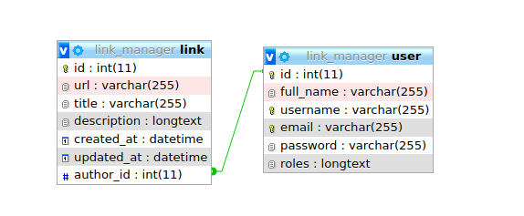

# Implementació de les relacions
{: .no_toc }


## Taula de continguts
{: .no_toc .text-delta  .nocount }

1. TOC
{:toc}
## Introducció

Anem a relacionar cada enllaç amb l'autor (usuari). Es tracta d'una relació _molts a un_, ja que cada Link tindrà un autor però cada autor pot tindre més d'un enllaç.

Executarem

```console
 $php bin/console make:entity Link

 Your entity already exists! So let's add some new fields!

 New property name (press <return> to stop adding fields):
 > author

 Field type (enter ? to see all types) [string]:
 > ManyToOne

 What class should this entity be related to?:
 > User

 Is the Link.author property allowed to be null (nullable)? (yes/no) [yes]:
 > yes

 Do you want to add a new property to User so that you can access/update Link objects from it - e.g. $user->getLinks()? (yes/no) [yes]:
 > yes

 A new property will also be added to the User class so that you can access the related Link objects from it.

 New field name inside User [links]:
 > links

 updated: src/Entity/Link.php
 updated: src/Entity/User.php

 Add another property? Enter the property name (or press <return> to stop adding fields):
 >

  Success! 

 Next: When you're ready, create a migration with make:migration
```

### Revisió dels canvis

```php
    // src/Entity/Link.php
    ...
    /**
     * @ORM\ManyToOne(targetEntity="App\Entity\User", inversedBy="links")
     */
    private $author;
```

```php
    // src/Entity/User.php

    /**
     * @ORM\OneToMany(targetEntity="App\Entity\Link", mappedBy="author")
     */
    private $links;

    public function __construct() {
        ...
        $this->links = new ArrayCollection();
    }
```

### Aplicar els canvis a la base de dades

Després aplicarem els canvis a la base de dades mitjançant `make:migration` primer i `doctrine:migrations:migrate` després.


```console
php bin/console make:migration

  Success!

 Next: Review the new migration "src/Migrations/Version20200126202501.php"
 Then: Run the migration with php bin/console doctrine:migrations:migrate
 See https://symfony.com/doc/current/bundles/DoctrineMigrationsBundle/index.html

php bin/console doctrine:migrations:migrate

                    Application Migrations                    

WARNING! You are about to execute a database migration that could result in schema changes and data loss. Are you sure you wish to continue? (y/n)y
Migrating up to 20200126203008 from 0

  ++ migrating 20200126203008

     -> ALTER TABLE user CHANGE roles roles JSON NOT NULL
     -> ALTER TABLE link ADD author_id INT DEFAULT NULL
     -> ALTER TABLE link ADD CONSTRAINT FK_36AC99F1F675F31B FOREIGN KEY (author_id) REFERENCES user (id)
     -> CREATE INDEX IDX_36AC99F1F675F31B ON link (author_id)

  ++ migrated (took 149.4ms, used 16M memory)

  ------------------------

  ++ finished in 151.5ms
  ++ used 16M memory
  ++ 1 migrations executed
  ++ 4 sql queries

```

## Comprovació dels canvis

Els canvis són els següents

```sql
ALTER TABLE link ADD author_id INT DEFAULT NULL
ALTER TABLE link ADD CONSTRAINT FK_36AC99F1F675F31B FOREIGN KEY (author_id) REFERENCES user (id)
CREATE INDEX IDX_36AC99F1F675F31B ON link (author_id)
```


{:.alert .alert-info }
Més informació en [How to Work with Doctrine Associations / Relations](https://symfony.com/doc/current/doctrine/associations.html)

## Modificant el formulari

Ara caldrà modificar el formulari de _Link_ per poder assignar l'usuari que ha enviat l'enllaç. Afegirem un camp de tipus [EntityField](https://symfony.com/doc/current/reference/forms/types/entity.html) indicant en l'array d'opcions la classe `User::class` i que l'etiqueta que es mostrarà serà `fullname`.

```php
// src/Forms/LinkType.php
public function buildForm(FormBuilderInterface $builder, array $options)
{
    $builder
        ->add('url')
        ->add('title')
        ->add('description')
        ->add('createdAt')
        ->add('updatedAt')
        ->add('author', EntityType::class, ['class'=>User::class,
                                           'choice_label'=>'fullname']);
    }
```
La configuració del formularis és molt flexible, en el cas del camp `roles` del formulari d'Usuari podem modificar-lo perquè mostre en un `checkbox` els diferents rols d'usuari :

```php
// src/Forms/UserType.php
public function buildForm(FormBuilderInterface $builder, array $options)
{
    $builder
        ->add('fullName')
        ->add('username')
        ->add('email')
        ->add('password')
        ->add('roles', ChoiceType::class,
                [ 'choices'  => [
                    'Usuari normal' => 'ROLE_USER',
                    'Admnistrador' => 'ROLE_ADMIN'
                    ],
                    'multiple'=>true,
                    'expanded'=>true
                ]);

/*    $builder->get('roles')
        ->addModelTransformer(new CallbackTransformer(
            function ($rolesAsArray) {
                // transform the array to a string
                return implode(', ', $rolesAsArray);
            },
            function ($rolesAsString) {
                // transform the string back to an array
                return explode(', ', $rolesAsString);
            }
        ));
    */
}
```
Més informació sobre els diferents tipus de camps dels formularis de Symfony en [Form Types Reference](https://symfony.com/doc/current/reference/forms/types.html)