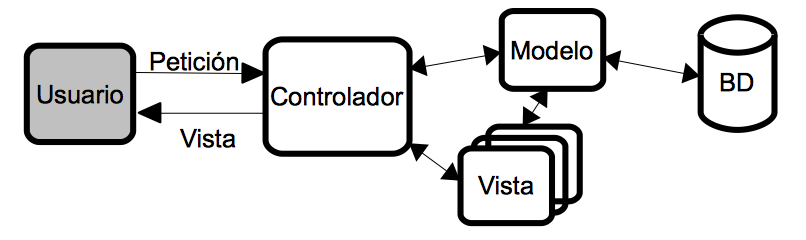
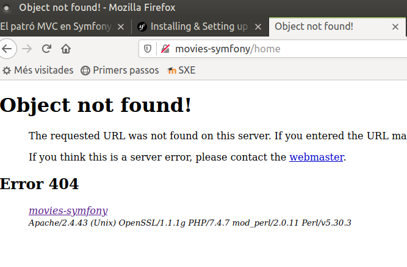

# El patró MVC en Symfony
{:.no_toc }

1. Taula de continguts
{:toc}

## El patró MVC

MVC són les sigles de Model-Vista-Controlador (o en anglès,
_Model-View-Controller_), i és el patró d'arquitectura de programari per
excel·lència ara mateix en el món de les aplicacions web, i fins i tot
de moltes aplicacions d'escriptori.

Com el seu nom indica, aquest patró es basa a dividir el disseny o
l'estructura d'una aplicació web en tres components fonamentals:

-   El **model**, que podríem resumir com el conjunt de totes les dades
    o informació que maneja l'aplicació. Típicament seran variables o
    objectes extrets d'una base de dades o qualsevol altre sistema
    d'emmagatzematge, per la qual cosa el codi del model normalment
    estarà format per instruccions per a connectar amb la base de dades,
    recuperar informació d'ella i emmagatzemar-la en algunes variables
    determinades. Per tant, no tindrà coneixement de la resta de
    components del sistema.
-   La **vista**, que és l'intermediari entre l'aplicació i l'usuari, és
    a dir, la qual cosa l'usuari veu en pantalla de l'aplicació. Per
    tant, la vista la compondran les diferents pàgines, formularis, etc,
    que l'aplicació mostrarà a l'usuari per a interactuar amb ell.
-   El **controlador** (o controladors), que són els fragments de codi
    encarregats de coordinar el funcionament general de l'aplicació.
    Davant peticions dels usuaris, les arrepleguen, les identifiquen, i
    accedeixen al model per a actualitzar o recuperar dades, i al seu
    torn, decideixen què vestisca mostrar-li a l'usuari a continuació
    de l'acció que acaba de realitzar.

És un patró arquitectònic disseny molt concís i ben estructurat, la qual cosa li ha
valgut la fama que té avui dia. Entre els seus molts avantatges, permet
aïllar el codi dels tres elements involucrats (vista, model i
controlador), de manera que el treball és molt més modular i divisible,
podent encarregar-se de les vistes, per exemple, un dissenyador web que
no tinga molta idea de programació en el servidor, i del controlador un
programador PHP que no tinga moltes nocions d'HTML.

En forma d'esquema, podríem representar-ho així:



Les peticions de l'usuari arriben al controlador, que les identifica, i
es comunica amb el model per a obtenir les dades necessàries, i amb les
vistes per a decidir què mostrar a continuació i omplir-la amb
les dades del model, per a després servir-li-la a l'usuari com a
resposta. En aquesta sessió veurem com definir controladors en Symfony,
i associar-los a rutes, de manera que mostren algun contingut o vista
com a resposta.

## Controladors i rutes en Symfony

Per a crear pàgines en una aplicació Symfony es necessiten dos elements:
una ruta (és a dir, una URI que indique a quin contingut accedir de la
web) i un controlador associat a ella, que serà l'encarregat de mostrar
el resultat (la pàgina) per a aqueixa petició de ruta.

### El concepte de ruta en Symfony

Les rutes en Symfony poden ser tradicionals o amigables. Una ruta
tradicional és aquella la part dinàmica de la qual s'especifica en la
query string. Per exemple, si volem saber la fitxa d'una pel·lícula a
través del seu codi, tindríem una URL com aquesta:

```
http://movies-symfony/movie.php?id=
```
Les rutes amigables són aquelles que separen els seus elements únicament
per barres `/`, de manera que la part dinàmica de la ruta s'intercala
entre aqueixes barres. La URL anterior, en forma amigable, quedaria
així:

```
http://movies-symfony/movie/
```

De pas, amb les rutes amigables se sol emmascarar el tipus d'arxiu que
s'està sol·licitant, amb el que s'omet la informació de si és una
pàgina PHP, o HTML, o de qualsevol altre tipus. Ens centrarem en
aquestes altres rutes en aquest curs.

##  El nostre primer controlador

Un controlador en Symfony és bàsicament una classe que conté mètodes PHP l'únic
propòsit dels qual és obtenir la petició de l'usuari per a una ruta
concreta, processar-la i enviar-li una resposta. 

Els controladors se situen dins de la carpeta `src` del nostre projecte
Symfony, concretament en l'espai de noms `Controller` que ja està creat.

---
##  El nostre primer controlador

```php
namespace App\Controller;
use Symfony\Component\HttpFoundation\Response;
use Symfony\Component\Routing\Annotation\Route;
class HomeController
{
    /**
     * @Route("/", name="home")
     */
    public function home()
    {
        return new Response("Welcome to movies web site");
    }
}
```

Observa el codi de la classe, i el del mètode `home()` en concret.
Simplement mostra un missatge de benvinguda a través d'un objecte
`Response`, que s'empra per a definir la resposta a enviar. Si guardem
els canvis i accedim a http://movies-symfony, veurem aquest missatge
de benvinguda.

### Definir els espais de noms (_namespaces_)

Si fas una ullada al codi del controlador anterior, veuràs que comença
amb la línia:

```php
namespace App;
```
El que estem fent és situar la classe (`HomeController`, en aquest cas)
dins d'un espai de noms. Cada subcarpeta que hi ha dins de la carpeta
`src` constitueix un espai de noms, de manera que quan situem un arxiu
font dins d'una d'aqueixes subcarpetas, hem d'indicar que pertany a
aquest espai de noms. Tots aquests espais de noms pengen d'una arrel
`App`, per la qual cosa l'espai de noms per al nostre controlador és
`App` (els subespais se separen amb barres invertides).

Els espais de noms són útils en aplicacions amb molts arxius font, com
solen ser les aplicacions web més o menys importants, ja que es corre el
risc de cridar exactament igual a dues classes que estiguen en carpetes
diferents. Si les agrupem per espais de noms, no hi haurà problema a
cridar igual a les classes i als arxius. El concepte és similar al de
paquet (_package_) en llenguatges com Java. De fet, en Java tenim molts
exemples de classes que es diuen igual i pertanyen a paquets diferents,
amb el que són fàcilment diferenciables.

#### Incloure altres espais de noms en el fitxer actual

Tornem de nou al codi del controlador. Després de definir a quin espai
de noms pertany aquest controlador (`App`), podem necessitar utilitzar
objectes d'altres espais de noms. En aquest cas, per exemple, utilitzem
un objecte `Response` que pertany a l'espai `Symfony`. Per a poder
utilitzar aquest objecte de forma còmoda i no haver de col·locar tot
aquest prefix cada vegada que vulguem fer referència al tipus `Response`,
hem d'afegir una instrucció use indicant la ruta completa fins a la
classe que anem a utilitzar:

```php
use Symfony;
```
Després d'açò, ja podrem referenciar a la classe `Response` directament
pel seu nom en qualsevol lloc d'aquest fitxer font. De la mateixa
manera, podem afegir totes les línies use que considerem, per a fer 
referència a tots els elements externs que anem a necessitar.

També podem definir un àlies per a nomenar a la classe incorporada dins
de nostre arxiu font. Si, en lloc d'utilitzar `Response`, volem
referenciar a aquest tipus amb una forma més abreujada (Res,
per exemple), faríem açò:

```php
use Symfony as Res;
 ...
  return new Res(...);
```

#### Crear controladors per línia de comandos

Mitjançant el comando `bin/console` podem crear un controlador, amb la
instrucció:

```shell
php bin/console make:controller ControllerName
```

Es crearà automàticament un arxiu `ControllerName.php` en la carpeta
`src/Controller`, i una plantilla associada al mateix, en la carpeta
`templates` o alguna subcarpeta. Com a avantatge destacable d'aquesta
forma de crear controladors, ens crea automàticament el _namespace_ i afig
els recursos externs (_use_) que necessitem. Però, com a desavantatge, ens
crea una plantilla i unes connexions amb ella que normalment no
necessitarem, i haurem de retocar.

### Definint rutes

Fem una ullada més al codi del controlador que hem fet. Abans del mètode
`home` hi ha un comentari, en el qual es veu una anotació anomenada
`Route` que està mapejant aqueix mètode amb una ruta.

```php
/*** 
    @Route("/", name="home") 
*/ 
public function home() ...
```
El que ve a dir aqueixa anotació és que, quan accedim a l'arrel de
l'aplicació, s'activarà aquest mètode i s'enviarà la resposta
corresponent (el missatge de benvinguda). A més, associa la ruta amb un
nom (_name_) `home`, la qual cosa ens servirà per a fer que el
controlador siga independent de la ruta, com veurem després.

#### Una altra forma de definir rutes: l'arxiu `config/routes.yaml`

Existeix una forma alternativa de definir rutes sense utilitzar
anotacions, que consisteix a editar l'arxiu `config/routes.yaml` i afegir
la nova ruta amb el controlador i nom associats. Per exemple, per al cas
anterior, si volem que en accedir a l'arrel de l'aplicació s'active
el mètode `home` del controlador `HomeController`, assignant-li a la
ruta el nom `home` (tal com hem fet en l'exemple anterior), afegiríem
aquestes línies al fitxer:

```yaml
home: 
    path: /
    controller: App\Controller\HomeController::home
```
No obstant açò, si atenem a la documentació oficial de Symfony, **es
recomana definir les rutes mitjançant anotacions**, per la qual cosa
d'ara endavant utilitzarem aquest mecanisme en les anotacions.

### Comprovar les rutes de la nostra aplicació

Utilitzant la consola de Symfony (fitxer `bin/console` del nostre projecte)
podem comprovar quines rutes hi ha actualment definides en la nostra
aplicació, mitjançant aquest comando:

```shell
php bin/console debug:router
```

Mostrarà el llistat de rutes, indicant el seu nom, i la ruta associada.
A més de la nostra ruta arrel, apareixeran altres rutes creades per
defecte per a opcions de depuració i testeo, com per exemple les rutes
profiler per a rastrejar i obtenir detalls de les peticions realitzades.
No entrarem en aqueixos detalls en aquest curs.

#### Configurar la reescriptura de rutes

Abans de continuar, hi ha un cosa que hem de tenir en compte: el
controlador que hem provat (`HomeController::home`) funciona
perquè fa referència a l'arrel de l'aplicació. Si canviem la ruta per
qualsevol altra, com per exemple `/home`, no funcionarà:



El motiu és que encara no tenim configurat el nostre projecte perquè
reescriga les rutes de forma amigable. Per a açò, hauríem de tenir un
arxiu `.htaccess` en la carpeta `public` amb els paràmetres de configuració
d'Apache per a aqueixa reescriptura. Com aqueixa tasca és una miqueta
manual, l'eina `composer` posa a la nostra disposició un parell de 
comandos per a fer-ho per nosaltres. 

Des de la carpeta del nostre projecte escriurem:

```shell
composer require symfony/apache-pack
```

En executar-lo ens mostrarà el següent missatge:

```shell
Symfony operations: 1 recipe (5a8f9ff66bdb49d40606adc556254e91)
  -  WARNING  symfony/apache-pack (>=1.0): From github.com/symfony/recipes-contrib:master
    The recipe for this package comes from the "contrib" repository, which is open to community contributions.
    Review the recipe at https://github.com/symfony/recipes-contrib/tree/master/symfony/apache-pack/1.0

    Do you want to execute this recipe?
    [y] Yes
    [n] No
    [a] Yes for all packages, only for the current installation session
    [p] Yes permanently, never ask again for this project
    (defaults to n): 
```
Al que respondrem `y` o `p` si volem que no ens torne a preguntar.

<div markdown="1" class="alert-info alert">
Les receptes de Symfony permeten automatitzar la configuració de paquets Composer mitjançant el connector Symfony Flex Composer.

Les receptes del dipòsit `contrib` són contribucions de tercers, és
a dir, no són receptes dels desenvolupadors oficials de Symfony.

Aquest és el cas de la recepta `symfony/apache-pack`, per la qual cosa ens pregunta si volem instal·lar-la igualment.
</div>

A partir d'aquest punt, ja podrem crear les rutes amigables que vulguem
en el nostre projecte. **Recorda repetir aquests comandos en tots els
projectes Symfony que utilitzen rutes amigables**.

#### Rutes amb paràmetres

Existeixen algunes rutes que tenen parts variables. Per exemple, si
volguérem mostrar la fitxa d'una pel·lícula (el seu títol, el poster 
i la seua sinopsi), a partir del seu codi, podríem plantejar una ruta com a
http://movies-symfony/movies/54, i que el controlador ens mostrara
la informació de la pel·lícula número 54. Però, si cridem a aqueixa ruta amb
un altre codi, haurà de mostrar la informació de la pel·lícula amb l'altre codi.

Anem a crear un nou controlador en el nostre espai de noms
`Controller` dins de la carpeta `src`. En aquest cas, cridarem a la classe
`MovieController`. Definirem un mètode anomenat `show`, que mostrarà la
fitxa de la pel·lícula  en el codi del qual li arribe en la ruta, encara que de
moment només mostrarà un missatge amb el codi de la pel·lícula indicat
en la ruta:

```php
namespace App\Controller;
use Symfony\Component\HttpFoundation\Response;
use Symfony\Component\Routing\Annotation\Route;
class MovieController
{
    /**
     * @Route("/movies/{id}", name="movies_show")
     */
    public function show($id)
    {
        return new Response("Movie data with id: $id");
    }
}
```
Observa com en la anotació afegim el `id` de la pel·lícula com un element
variable, gràcies a les claus (a aquesta notació se li crida _wildcard_).
El mètode associat a la ruta ha de tenir un paràmetre amb aqueixa
mateixa dada (l'identificador), de manera que puguem utilitzar-lo dins del
mètode. Si ara accedim a la URI `movies-symfony/movies/54` ens mostrarà
el missatge "Movie data with id: 54".

Anem a millorar un poc aquest controlador, per a simular que accedeix 
a una font de dades per a obtenir la informació. Fins a veure en sessions 
posteriors com connectar amb MySQL, anem a crear-nos el nostre propi array de 
pel·lícules en la classe _MovieController_, i farem
que el mètode `show` mostre les dades del contacte el codi del qual
s'haja indicat. El controlador quedarà així:
```php
namespace App\Controller;
use Symfony\Component\HttpFoundation\Response;
use Symfony\Component\Routing\Annotation\Route;
class MovieController
{
    private array $movies = [
        ["id"=>"2", "title" => "Ava", "tagline" => "Kill. Or be killed", 
            "release_date" => "25/09/2020"],
        ["id" => "3", "title" => "Bill &Ted Face the Music", 
            "tagline" => "The future awaits", "release_date" => "24/09/2020"],
        ["id" => "4", "title" => "Hard Kill", 
            "tagline" => "Take on a madman. Save the world.", "release_date" => "14/09/2020"],
        ["id" => "5", "title" => "The Owners", "tagline" => "", 
            "release_date" => "10/05/2020"],
        ["id" => "6", "title" => "The New Mutants", 
            "tagline" => "It's time to face your demons.", "release_date" => "20/04/2020"],        
    ];


    /**
     * @Route("/movies/{id}", name="movies_show")
     */
    public function show($id)
    {
        $result = array_filter($this->movies,
            function($movie) use ($id)
            {
                return $movie["id"] == $id;
            });
        if (count($result) > 0)
        {
            $response = "";
            $result = array_shift($result);
            $response .= "<ul><li>" . $result["title"] . "</li>" .
            "<li>" . $result["tagline"] . "</li>" .
            "<li>" . $result["release_date"] . "</li></ul>";
            return new Response("<html><body>$response</body></html>");
        }
        else
            return new Response("Movie not found");
    }
}
```

Com veiem, hem definit un array de pel·lícules, i dins del mètode filtrem
amb `array_filter` aquell el codi del qual coincidisca amb l'indicat,
mostrant les seues dades en la resposta. Observa també com podem
incloure codi HTML en la pròpia resposta, encara que de seguida veurem
que hi ha formes més còmodes de fer açò.

#### Afegir requisits a les wildcards

Imaginem que volem definir un cercador de pel·lícules, de manera que li
passem com a part variable de la ruta una part del nom, i ens retorna
totes les pel·lícules que coincidisquen. Així, per a la "base de dades"
anterior, si accedírem a la ruta `/movies/The` ens mostraria les
pel·lícules "The new mutants" i "The owners". Definim un segon mètode en
la nostra classe MovieController per a processar aquesta ruta.
Quedaria així:

```php
    /**
     * @Route("/movies/{text}", name="movies_filter")
     */
    public function filter($text)
    {
        $result = array_filter($this->movies,
            function($movie) use ($text)
            {
                return strpos($movie["title"], $text) !== false;                
            });
        $response = "";
        if (count($result) > 0)
        {
            foreach ($result as $movie) {
                $response .= "<ul><li>" . $movie["title"] . "</li>" .
            "<li>" . $movie["tagline"] . "</li>" .
            "<li>" . $movie["release_date"] . "</li></ul>";
            }
            return new Response("<html><body>$response</body></html>");
        }
        else
            return new Response("No movies found");
    }
}
```


Si intentem llançar la URL anterior
(http://movies-symfony/movies/The), obtindrem com a resultat
"Movie not found", que és el missatge corresponent al controlador
anterior (la fitxa de pel·lícula) quan no es trobava la pel·lícula amb el
codi indicat. És a dir, s'ha llançat el controlador equivocat, i el
motiu és simple: hem definit dues rutes a priori diferents:

- `/movies/{id}` per a la fitxa de la pel·lícula
- `/movies/{text}` per a cercar pel·lícules pel títol

No obstant açò, a efectes pràctics, ambdues rutes són el mateix: el
prefix `/movies` seguit del que siga. En aquesta situació, Symfony
llança el primer dels controladors la ruta dels quals coincidisca amb la
indicada (el de la fitxa de pel·lícules, en aquest cas).

Per a diferenciar ambdues rutes, necessitem un criteri, i en aquest cas,
el criteri serà que la fitxa de la pel·lícula necessita que el paràmetre
id siga numèric. Açò s'especifica mitjançant la propietat
requirements i una expressió regular, en definir la ruta de la fitxa:

```php
@Route("/movies/{id}", name="movies_show", requirements={"id"="\d+"})
```
Des de Symfony 4.1, també es pot emprar aquesta altra notació més
abreujada per a incloure el requeriment en el wildcard:
```
@Route("/movies/{id}<\d+>", name="movies_show")
```
#### Afegir valors per defecte a les _wildcards_

En algunes ocasions, també ens pot interessar donar un valor per defecte
a una _wildcard_ perquè, si en la ruta no s'especifica res, tinga aquest
valor per defecte. Açò s'aconsegueix assignant un valor per defecte al
paràmetre associat en el controlador. En el cas de la fitxa de la pel·lícula
anterior, si volguérem que quan s'introduïsca la ruta `/movies` (sense
id), es mostrara per defecte la pel·lícula amb codi 2, faríem açò:

```php
/**
 * @Route("/movies/{id}", name="movies_show", requirements={"id"="\d+"})
 */
public function show($id = 2)
```

encara que des de Symfony 4.1 també es pot especificar en la pròpia
anotació, d'aquesta altra forma:

```php
@Route("/movies/{id}<\d+>?2", name="movies_show")
```

Per a més informació podeu consultar la documentació oficial de Symfony:
[Routing](https://symfony.com/doc/current/routing.html)

