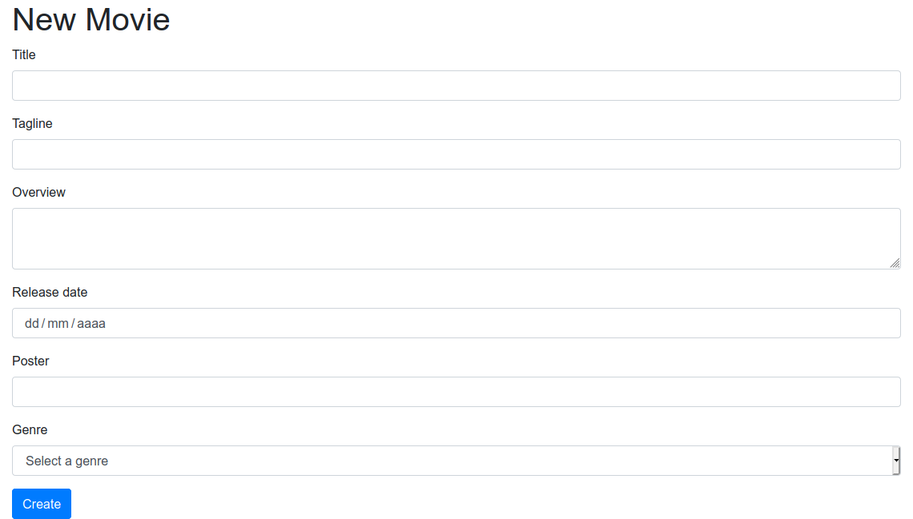

# 6. Generació de formularis i validació de dades
{:.no_toc}

1. Taula de continguts
{:toc}

## Generació de formularis

Fins a aquesta sessió hem après alguns conceptes útils de Symfony i
alguns dels seus _bundles_ més destacats, com per exemple la generació de
vistes amb el motor de plantilles Twig, el desenvolupament de serveis, o
la comunicació amb la base de dades a través de l'ORM Doctrine. Hem fet
alguns controladors d'exemple per a cercar dades, o per a inserir.
Però, en aquest últim cas, al no disposar encara d'un mecanisme perquè
s'envien dades d'inserció des del client, hem optat ara com ara per
inserir unes dades prefixades, és a dir, una pel·lícula amb unes dades 
ja predefinides en el codi.

En aquesta sessió veurem de quina forma es poden definir formularis en
Symfony associats a una determinada entitat, perquè el que s'envie en
el formulari s'associe a un objecte d'aquesta entitat, i perquè puguem
pre­carregar el formulari amb les dades d'una entitat ja existent, amb
la finalitat de poder-los modificar.

### Creació del formulari en el controlador

Els formularis poden crear-se fàcilment des de qualsevol controlador.
N'hi ha prou que creem o obtinguem l'objecte associat al formulari
(per exemple, una pel·lícula), i carreguem un formulari amb ell. En la
nostra aplicació de pel·lícules, anem a crear un nou controlador que
responga a la URI `/movies/create`, i que cree una pel·lícula buida i la mostre al
formulari.

```php
namespace App\Controller;
...
use Symfony\Component\Form\Extension\Core\Type\TextType;
use Symfony\Component\Form\Extension\Core\Type\SubmitType;
class MovieController extends AbstractController
{
...
/**
* @Route("/movies/create", name="movies_create")
*/
public function create()
{
    $movie = new Movie();
    $form = $this->createFormBuilder($movie)
        ->add('title', TextType::class)
        ->add('tagline', TextType::class)
        ->add('overview', TextareaType::class)
        ->add('releaseDate', DateType::class)
        ->add('poster', TextType::class)
        ->add('create', SubmitType::class, array('label' => 'Create'))
        ->getForm();
    return $this->render('create.html.twig', array(
    'form' => $form->createView()));
}
...

```
Com podem veure, a través del _form builder_ de Symfony es crea el
formulari. Després, afegim tants camps com a atributs tinga l'entitat
(normalment), associant cada atribut amb el seu camp pel nom.

En cada camp especifiquem també de quin tipus és. En el nostre cas, hem
definit tres quadres de text (`TextType`) per al títol, l'eslogan i el poster, 
un camp de data (`DateType`) per a la data de l'estrena, un camp (`TextareaType`) per 
a la sinopsi i un botó de submit (`SubmitType`) per a poder enviar el formulari. Podeu
consultar en [Form Types Reference](https://symfony.com/doc/current/reference/forms/types.html) 
un llistat més detallat dels tipus de camps que tenim
disponibles. Alguns que poden resultar-nos interessants són:

-   `TextType` (quadres de text d'una sola línia, com l'exemple
    anterior)
-   `TextareaType` (quadres de text de diverses línies)
-   `EmailType` (quadres de text de tipus i­mail)
-   `IntegerType` (quadres de text per a nombres enters)
-   `NumberType` (quadres de text per a nombres en general)
-   `PasswordType` (quadres emmascarats per a passwords)
-   `EntityType` (desplegables per a triar valors vinculats a una altra
    entitat)
-   `DateType` (per a dates)
-   `CheckboxType` (per a checkboxes)
-   `RadioType` (per a botons de radi o radi buttons)
-   `HiddenType` (per a controls ocults)
-   ... etc.

#### Etiquetes personalitzades

Com podem veure per al cas del botó de submit, podem especificar un
tercer paràmetre en el mètode `add` que és un array de propietats del
control en qüestió. Una d'elles és la propietat `label`, que ens permet
especificar quin text tindrà associat el control. Per defecte, s'associa
el nom de l'atribut corresponent en l'entitat, però podem canviar-ho
per un text personalitzat. Per a l'i­mail, per exemple, podríem posar:

```php
    ->add('email', EmailType::class, array('label' => 'Correu
        electrònic'))
```

#### Millorant el nostre formulari

Aprofitant la varietat de tipus de camps que ofereix Symfony, anem a
millorar una mica el nostre formulari:

-   Per al gènere que afegírem en la sessió de
    Doctrine, podem emprar un EntityType que prenga les seues dades de
    l'entitat `Genre`.

Amb açò, el formulari quedaria així:

```php
   ->add('genre', EntityType::class, ['class' =>
            Genre::class, 'choice_label' => 'name']) ...
```

### Renderitzant el formulari

El codi del controlador anterior acaba renderitzant una vista cridada
`new.html.twig` que, ara com ara, no existeix. En aquesta vista haurem de
renderizar el formulari. Podria quedar-se així:


```php


Movies


    <h1>New Movie</h1>
    {{ form_start(form) }}
        {{ form_widget(form) }}
    {{ form_end(form) }}

```


Les tres línies sota l'encapçalat h1 són les responsables de
la renderización del formulari, a partir del paràmetre `form` que 
li passem des del controlador.

Si ara accedim a `movies-symfony/movies/create` podrem veure el
formulari:


### Emplenant els camps del formulari

Tornem al nostre nou controlador. Si construïm un objecte farcit amb
dades, veurem cada dada en el seu camp associat:

```php
public function create()
{
    $movie = new Movie();
    $movie->setTitle(" Groundhog Day");
    $movie->setTagline("He’s having the worst 
        day of his life … over, and over …");      
    $movie->setReleaseDate(new \DateTime("1993-05-07"));

    $form = $this->createFormBuilder($movie)
...
```
## Enviament de formularis

Parlem ara sobre com enviar el formulari. Per defecte, si no s'indica
gens, el formulari s'envia per POST a la mateixa URI que el genera (en
el nostre cas, a `movies/create`. De fet, si intentem enviar el formulari
en aquest moment, amb les dades que siguen, es tornarà a carregar la
vista del formulari, però no haurem inserit res.

Per a gestionar l'enviament d'aquestes dades, cal fer algunes
modificacions sobre el nostre controlador:

-   En primer lloc, el controlador rebrà un objecte `Request`, que
    contindrà les dades del formulari enviat (en el cas que s'haja
    enviat)
-   En segon lloc, dins del codi del controlador, hem de processar
    aqueixes dades (si n'hi ha), validar-les (açò ho veurem a
    continuació) i si són vàlides, realitzar la corresponent inserció o
    modificació.
-   Finalment, podem redirigir a una altra ruta en cas d'èxit, o tornar
    a renderizar el formulari en cas d'error, o en cas que no s'haja
    enviat (per exemple, quan carreguem el formulari per a emplenar-ho).

Unint aquestes premisses, el nostre controlador quedaria així:

```php
# src/Controller/MovieController.php
     /**
     * @Route("/movies/create", name="movies_create")
     */
    public function create(Request $request)
    {
   
        ...
        $form->handleRequest($request);

        if ($form->isSubmitted() && $form->isValid()) {
            $movie = $form->getData();
            $entityManager = $this->getDoctrine()->getManager();
            $entityManager->persist($movie);
            $entityManager->flush();
            return $this->redirectToRoute('home');
        }
        return $this->render('movies_create.html.twig', array(
            'form' => $form->createView()));

    ...
    }
```
Si provem ara a carregar el formulari i realitzar una inserció, ens
enviarà a la pàgina d'inici, i podrem veure la nova pel·lícula en
la taula corresponent de la base de dades.

### Modificació de dades

El que hem fet en l'exemple anterior és una inserció d'un nova
pel·lícula, però... com seria fer una modificació de pel·lícula existent?.
El funcionament seria molt similar, però amb un petit canvi: la ruta del
controlador rebrà com a paràmetre l'identificador de la pel·lícula a modificar, 
i a partir d'ací, cercaríem la pel·lícula i el carregaríem en el formulari,
incloent el seu `id` en un camp ocult. D'aquesta forma, en fer `persist`
es modificaria la pel·lícula existent.

Podem provar-ho amb aquest controlador:

```php
  /**
     * @Route("/movies/{id}/edit", name="movies_edit")
     */
    public function edit(int $id, Request $request)
    {
        $movieRepository = $this->getDoctrine()->getRepository(Movie::class);
        $movie = $movieRepository->find($id);

        $form = $this->createFormBuilder($movie)
            ->add('id', HiddenType::class)
            ->add('title', TextType::class)
            ->add('tagline', TextType::class)
            ->add('overview', TextareaType::class)
            ->add('releaseDate', DateType::class,
                ['widget' => "single_text"]
            )
            ->add('poster', TextType::class)
            ->add('genre', EntityType::class,
                ['class' => Genre::class,
                    'choice_label' => 'name',
                    'placeholder' => 'Select a genre',
                ]
            )
            ->add('create', SubmitType::class, array('label' => 'Create'))
            ->getForm();

        $form->handleRequest($request);

       ...
    }
```

Veiem que el codi és molt similar al de la inserció, excepte pel paràmetre
id que rep el controlador amb el codi de la pel·lícula a editar, la
cerca inicial d'aquesta película en la base de dades, i el camp ocult `id` en el formulari.

<div markdown="1" class="alert-warning alert">
Recorda que Symfony ens proporciona la possibilitat de fer _autowiring_ de 
les entitats, afegint-les com a paràmetres en lloc del seu `id`.
</div>

Recorda afegir el corresponent use al principi perquè reconega la classe
`HiddenType`.

Ara, si accedim a `movies-symfony/movies/1/edit`, per exemple
(suposant que tinguem una pel·lícula amb id = 1 en la base de dades), es
carregarà el formulari amb les seues dades, i en enviar-lo, es
modificaran els camps que hàgem canviat, i es carregarà la pàgina
d'inici.

## Validació de formularis

Ara que ja sabem crear, enviar i gestionar formularis, vegem un últim
pas, que seria la validació de dades d'aquests formularis prèvia al seu
enviament. En el cas de Symfony, la validació no s'aplica al formulari,
sinó a l'entitat subjacent (és a dir, a la classe `Movie`, en el nostre cas).

Per tant, la validació l'obtindrem afegint una sèrie de restriccions o
comprovacions a aquestes classes. Per exemple, per a indicar que el títol, 
el poster i la data de l'estrena no poden estar buits, afegim aquestes
anotacions en els atributs de la classe `Movie`:

```php
#src/Entity/Movie.php
...
use Symfony\Component\Validator\Constraints as Assert;
/**
 * @ORM\Entity(repositoryClass=MovieRepository::class)
 */
class Movie
{   ...
    /**
     * @ORM\Column(type="string", length=100)
     * @Assert\NotNull
     */
    private $title;

    /**
     * @ORM\Column(type="string", length=255, nullable=true)
     */
    private $tagline;

    /**
     * @ORM\Column(type="string", length=100)
     * @Assert\NotNull
     */
    private $poster;

    /**
     * @ORM\Column(type="date")
     * @Assert\NotNull
     */
    private $releaseDate;
    ...
```
Perquè aquestes assercions s'activen caldrà desactivar la validació en el client
indicant que el formulari ha de tindre l'atribut `novalidate`:


```php
# templates/movies-create.html.twig

{{ form_start(form, {attr: {'novalidate': 'novalidate'}}) }}
```


```
Aquestes funcions de validació admeten una sèrie de paràmetres útils. Un
dels més útils és `message`, que s'empra per a determinar el missatge
d'error que mostrar a l'usuari en cas que la dada no siga vàlida. Per
exemple, per al títol, podem especificar aquest missatge d'error:

```php
    /**
     * @ORM\Column(type="string", length=100)
     * @Assert\NotNull(message="The title is mandatory")
     */
    private $title;
```
I es dispararà quan no inserim títol i intentem enviar el
formulari:

Podeu trobar més informació sobre quines assercions es poden usar per a
validar dades en la documentació oficial de Symfony: [Validation](https://symfony.com/doc/current/validation.html).

## Altres consideracions finals

Per a finalitzar aquesta sessió, vegem algunes qüestions que hem deixat
en el tinter i no deixen de ser igualment importants.

### Creació de classes per a formularis

Fins ara, hem definit els formularis directament en els controladors
afectats. Així, en el cas de l'aplicació de pel·lícules, hem definit un
formulari per a la ruta `/movies/create` i un altre (el mateix,
pràcticament) per a la ruta `/movies/{id}/edit`.

El recomanat, segons la documentació de Symfony, és no situar els
formularis directament en els controladors, sinó crear-los en una classe
a banda. D'aquesta forma, podríem reutilitzar els formularis en diversos
controladors, i no repetir codi innecessàriament.

Vegem com quedaria aquesta classe per al formulari d'inserció i edició
de pel·lícules. Com sempre, podem crear el formulari on vulguem, però per
unificar criteris, i seguint els exemples de la documentació de Symfony,
crearem una carpeta `Form` en la nostra carpeta `src`, i posarem dins els
formularis. En el nostre cas, crearem una classe anomenada `MovieType`,
que heretarà d'una classe base genèrica de Symfony cridada
`AbstractType`. Dins, definim el mètode `buildForm` que s'encarregarà de
crear el formulari, com fèiem abans en el mètode nou o a editar:

```php
# src/Form/MovieType.php

public function buildForm(FormBuilderInterface $builder, array $options)
{
    $builder
        ->add('title', TextType::class)
        ->add('tagline', TextType::class)
        ->add('overview', TextareaType::class)
        ->add('releaseDate', DateType::class,
                ['widget' => "single_text"]
        )
        ->add('poster', TextType::class)
        ->add('genre', EntityType::class,
            ['class' => Genre::class,
                'choice_label' => 'name',
                'placeholder' => 'Select a genre',
            ]
        )
        ->add('create', SubmitType::class, array('label' => 'Create'));
    }
```
Ara, només ens queda reemplaçar el codi de crear el formulari en nou o
editar per l'ús d'aquesta nova classe:

```php
# src/Controller/MovieController.php
public function create(Request $request)
{
    $movie = new Movie();
    $form = $this->createForm(MovieType::class, $movie);

    $form->handleRequest($request);

    if ($form->isSubmitted() && $form->isValid()) {
        $movie = $form->getData();
        $entityManager = $this->getDoctrine()->getManager();
        $entityManager->persist($movie);
        $entityManager->flush();
        return $this->redirectToRoute('home');
    }
    return $this->render('movies_create.html.twig', array(
        'form' => $form->createView()));
}
```

### Afegint estil als formularis

Els formularis que hem generat en aquesta sessió són molt funcionals,
però poc vistosos, ja que manquen d'estils CSS propis. Si volguérem
afegir CSS a aquests formularis, tenim diverses opcions.

Una opció rudimentària consisteix a afegir classes (atribut `class`) als
controls del formulari per a donar estils personalitzats. Després, en el
nostre CSS caldria indicar l'estil per a la classe en qüestió.

A més, Symfony ofereix diversos temes (_themes_) que podem aplicar als
formularis (i webs en general) per a donar-los una aparença general
basada en algun _framework_ conegut, com Bootstrap o Foundation. Si volem
optar per l'aparença de Bootstrap, hem de fer el següent:

1.  Incloure la fulla d'estils CSS i l'arxiu Javascript de Bootstrap
    en les nostres plantilles. Una pràctica habitual és fer-ho en la
    plantilla `base.html.twig` perquè qualsevol que herete d'ella adopte
    aquest estil. Per a açò, en la secció `stylesheets` hem d'afegir el
    codi HTML que hi ha en la documentació oficial de Bootstrap per a incloure 
    la seua fulla d'estil, i en la secció javascripts els enllaços a les diferents 
    llibreries que s'indiquen en la documentació de Bootstrap també.

2.  Editar l'arxiu de configuració `config/packages/twig.yaml` i indicar
    que els formularis usaran el tema de Bootstrap (en aquest cas,
    Bootstrap 4): 
    ```yaml
    twig: ... 
        form_themes:
            ['bootstrap_4_layout.html.twig']
    ```

Amb aquests dos canvis, l'aparença del nostre formulari de pel·lícules
queda així:



Hi ha altres alternatives, com per exemple no indicar aquesta
configuració general en `config/packages/twig.yaml` i indicar formulari
per formulari el tema que es vol usar.


```php
 
    {{ form_start(form) }} 
...
```


Existeixen també altres temes disponibles per a utilitzar. I també és possible
crear els teus propis. Podeu consultar més informació en 
[Symfony built-in form themes](https://symfony.com/doc/current/form/form_themes.html#symfony-built-in-form-themes)

### Afegir estils per a les validacions

En el cas de les validacions de dades del formulari, també podem definir
estils perquè els missatges que d'error que es mostren (paràmetre
message o similars en les anotacions de l'entitat) tinguen un estil
determinat. Açò s'aconsegueix fàcilment triant algun dels temes
predefinits de Symfony. 

## Exercicis

### Exercici 6.1

#### Movies 
Implementa el formulari d'inserció de pel·lícules seguient les indicacions

#### Projecte personal
Implementa el formular d'inserció de la teua entitat principal, si té 
relacions també.

### Exercici 6.2

#### Movies

Partint del formulari anterior, crea el controlador d'edició de
pel·lícules. 

#### Projecte personal

Crea el formulari d'edició de l'entitat principal del teu projecte personal.

### Exercici 6.3

#### Movies
Anem a validar la classe _Movie_ de la nostra aplicació de pel·lícules. Els
criteris de validació seran els següents:

-   Cap camp pot ser null, llevat de l'eslògan (_tagline_). 
-   El títol no podrà tindre una longitud superior a 100 caracters.

#### Projecte personal

Aplica la validació a l'entitat principal del teu projecte personal. 

### Exercici 6.4

#### Movies

Crea la classe `MovieType.php` en el projecte de pel·lícules, on definiràs
el formulari per a inserció i edició de pel·lícules basant-te en el vist en 
el punt anterior.

Afegir l'estil de Bootstrap 4 al formulari de
pel·lícules.

#### Projecte personal

Realitza en el teu projecte personal el mateix que has implementat en Movies.
