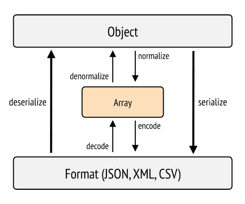

# Creació d'una API bàsica amb Symfony

Abans d'entrar en matèria alguns conceptes:
* **Serialitzar**. La serialització és el procés de convertir un objecte en una altre format per a emmagatzemar-lo o transmetre'l i posteriorment ser decodificat.
* **Normalitzar.** Ajuden en el procés de serialització, convertint els objectes en un element intermig, com pot ser una array.




El següent codi genera una API en la aplicació de pel·lícules:

```php
**
* @Route("/api/v1/movies")
*/
class ApiController extends AbstractController
{
    /**
     * @Route("/", name="api_movies_links", methods={"GET"})
     * @param Request $request
     * @param MovieRepository $movieRepository
     * @return JsonResponse
     */
    public function index(Request $request, MovieRepository $movieRepository): JsonResponse
    {
        $movies = $movieRepository->findAll();

        return new JsonResponse($movies, Response::HTTP_OK);
    }

    /**
     * @Route("/{id}", name="api_moives_show", methods={"GET"})
     * @param Request $request
     * @return JsonResponse
     */
    public function show(Request $request,  ?Movie $movie): JsonResponse
    {

        if (!empty($movie))
            return new JsonResponse($movie, Response::HTTP_OK);

        else
            return new JsonResponse("error", Response::HTTP_NOT_FOUND);
    }

    /**
     *
     * @Route("/", name="api_movies_create", methods={"POST"})
     */

    public function create(Request $request): JsonResponse
    {
        $movie = new Movie();
        $data = [];
        if ($content = $request->getContent()) {
            $data = json_decode($content, true);
        }
        
        try {
            $movie->setTitle($data["title"]);
            $movie->setOverview($data["overview"]);
            $movie->setTagline($data["tagline"]);
            $movie->setPoster($data["poster"]);
            $movie->setReleaseDate(new \DateTime($data["release_date"]));

        } catch (\Exception $e) {
            $error["code"] = $e->getCode();
            $error["message"] = $e->getMessage();
            return new JsonResponse($error, Response::HTTP_BAD_REQUEST);
        }
        $em = $this->getDoctrine()->getManager();
        $em->persist($movie);
        $em->flush();

        return new JsonResponse($movie, Response::HTTP_CREATED);
    }
}
```


## Recursos

En [Primeros pasos con Symfony 5 como API REST](https://itdo-solutions.medium.com/primeros-pasos-con-symfony-5-como-api-rest-f0fa8c4d5962) 
es genera una API basada en els mateixos components que hem utilitzat.

En [Getting started REST API with Symfony 4](https://www.adcisolutions.com/knowledge/getting-started-rest-api-symfony-4) 
s'utilitzen diversos components addicionals com el Fos-Rest-Bundle i JMS Serializer.

En [Curso de Symfony 5. Creando una API desde cero](https://www.youtube.com/playlist?list=PLC8ntN5__iMIAy9V6XO37Dx_bQ5V7zc-h) teniu
un curs molt complet sobre com crear una API en Symfony 5 des de cero.

[API Platform](https://api-platform.com/docs/core/getting-started/) és un framework que permet crear API de forma quasi automàtica en
Symfony.